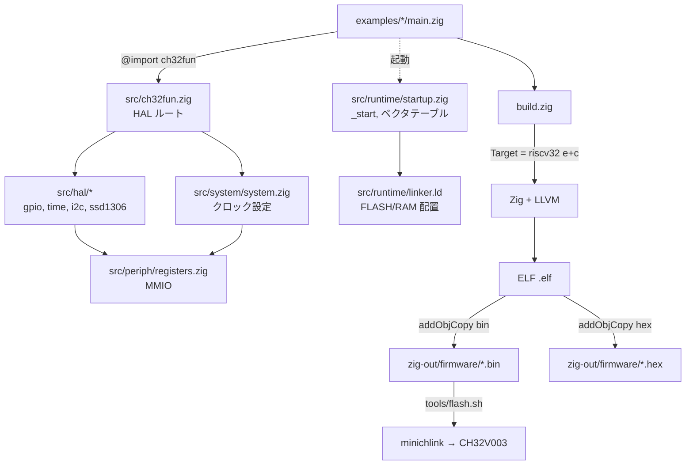

# Chapter 01: 本書の対象とゴール

## 学習目標

- 本プロジェクト `ch32fun_zig` が「何を / どの層で」実現しているのかを掴む
- CH32V003 という RISC-V MCU の概要を知る
- Zig 0.16 のクロスコンパイル機構が、なぜ追加の RISC-V GCC を使わずにファームウェアを生成できるのか、その全体像を見渡す
- 以降の章で深掘りする構成要素（ターゲット指定 / リンカ / ランタイム / objcopy / 書き込み）の役割分担を理解する

---

## 本プロジェクトが目指すもの

`ch32fun_zig` は、 [cnlohr/ch32fun](https://github.com/cnlohr/ch32fun) で確立された CH32V シリーズ向けの軽量な開発体験を、**Pure Zig** で再現することを狙った最小限のフレームワークである。

具体的には次の特徴を持つ。

- **CH32V003 (RISC-V RV32EC, 48MHz, FLASH 16K / SRAM 2K)** を主ターゲットとする
- **追加の RISC-V ツールチェイン (`riscv-none-elf-gcc` など) を必要としない**
  - Zig 自身が内蔵する LLVM バックエンドが RISC-V コードを直接生成する
- 書き込みのみ、ch32fun リポジトリに同梱の `minichlink` をそのまま使う
- `zig build` ひとつで `.elf` / `.bin` / `.hex` まで生成し、`zig build flash` でそのまま MCU に書き込める
- HAL は GPIO / SysTick / I2C / SSD1306 / 入力ボタンといった「最低限よくある」ものに絞ってある

つまり本リポジトリは、「組み込み RISC-V のクロス開発をやろうとすると普通は分厚くなる工程を、Zig の機能だけでどこまで薄くたためるか」の実験でもある。

---

## CH32V003 ざっくり仕様

| 項目 | 値 |
|---|---|
| MCU | CH32V003 (WCH) |
| CPU コア | QingKe RV32EC (RISC-V) |
| 命令セット | RV32E + C 拡張（I 拡張は **無い**） |
| 動作クロック | 最大 48 MHz |
| 内蔵 FLASH | 16 KB (`0x08000000` 開始) |
| 内蔵 SRAM | 2 KB (`0x20000000` 開始) |
| 割り込みコントローラ | PFIC (NVIC 風) |
| デバッグ | 1-wire SWIO |
| パッケージ | SOP8 / TSSOP20 など |

「2KB の RAM で何ができるんだ」というスケール感が重要で、本プロジェクトのコードサイズ・データサイズに対する制約は、ほぼここから来ている。

---

## 全体アーキテクチャ

ファームウェアが「書ける」までを上から下に並べると次のようになる。

ポイントは大きく 4 段に分かれる:

1. **アプリ層** — `examples/*/main.zig` が `ch32fun` モジュールを `@import` して HAL を呼ぶ
2. **HAL / システム層** — `src/hal/*.zig` と `src/system/system.zig` が MMIO に対する型付きアクセスを提供
3. **ランタイム / リンク層** — `src/runtime/startup.zig` が `_start` / ベクタテーブル / `.data` コピー / `.bss` ゼロクリアを担当し、`src/runtime/linker.ld` が FLASH / RAM の物理配置を決める
4. **ビルド / 書き込み層** — `build.zig` が `riscv32` ターゲットでコンパイル、`addObjCopy` で `.bin` / `.hex` に変換し、`tools/flash.sh` から `minichlink` を呼んで FLASH に焼く

このうち、本書で特に重点的に扱うのは **2〜4 段目** のしくみだ。「アプリの書き方」ではなく、「アプリを CH32V003 のフラッシュに乗るバイナリに変換するまでの道筋」のほうである。

---

## 本書のスコープと前提

本書は次のような読者を想定している。

- C/C++ で何らかの組み込み開発をしたことがあり、リンカスクリプトや objcopy の存在は知っている
- Zig の基本構文と `build.zig` を一度くらい触ったことがある
- RISC-V については「ARM とは別物の ISA」くらいの認識でも構わない

逆に、「Zig の言語仕様そのもの」「組み込み一般の入門」「SSD1306 の API ハウツー」は本書の主題ではない。それらは適宜参考リンクで触れるに留め、本書は **「ch32fun_zig という具体的なコードベースを題材に、Zig + LLVM で MCU 向け RISC-V ファームウェアをビルドする全段を解剖する」** ことに集中する。

---

## 章構成と読み進め方

| 部 | 章 | 主題 |
|---|---|---|
| I | 01〜03 | ターゲット指定とツールチェイン (RV32EC, Zig 0.16 のクロスコンパイル) |
| II | 04〜06 | リンカスクリプト、起動コード、ベクタテーブル |
| III | 07〜09 | `build.zig` の歩き方、objcopy、`minichlink` による書き込み |
| IV | 10〜12 | レジスタ抽象化と HAL の作り方 (GPIO/SysTick/I2C/SSD1306) |

順に読めば「ビルドが通る理由 → リンクと配置が成立する理由 → ELF からフラッシュに焼ける理由 → HAL の作法」を一気通貫で辿れる構成にしている。すでに該当章の内容を把握している読者は、興味のある章から拾い読みしてもよい。

次章では、CH32V003 のコアである **RV32EC** を Zig のターゲット指定で正しく表現するところから始める。
