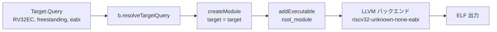

# Chapter 02: RV32EC というターゲットを正しく指定する

## 学習目標

- RISC-V の ISA 命名規則 (`RV32IMAC` のような表記) の読み方を理解する
- CH32V003 が採用する **RV32EC** が、一般的な RV32I 系と何が違うのかを知る
- Zig の `std.Target.Query` で「I を引き、E と C を足す」表現がどう書かれているかを読み解く
- `freestanding` / `eabi` という OS/ABI 指定の意味を押さえる

---

## RISC-V の ISA 名の読み方

RISC-V の ISA は、いくつかの基本セット + 拡張の組み合わせで表される。

- **基本セット**
  - `I` — 32 個の汎用整数レジスタ。RISC-V の標準。
  - `E` — **Embedded**。 汎用レジスタを 32 → **16 本** に削った組み込み向け派生。 `I` と排他。
- **代表的な拡張**
  - `M` — 整数の乗除算
  - `A` — アトミック命令 (LR/SC など)
  - `F` / `D` — 単精度 / 倍精度浮動小数点
  - `C` — **圧縮命令**。 16-bit 幅のショート形を追加し、コード密度を稼ぐ
  - `Zicsr` — CSR (制御/状態レジスタ) 命令
  - `Zifencei` — `fence.i` 命令

`RV32GC` などに使われる `G` は「`IMAFD_Zicsr_Zifencei`」のショートハンドで、 Linux クラスの環境向け。一方、本書で扱う CH32V003 はそんなに豪華ではなく、最小限の **`RV32EC`** である。

| 表記 | 含意 |
|---|---|
| `RV32`  | 32 ビット整数 |
| `E`     | レジスタ x0〜x15 までの 16 本のみ (組み込み派生) |
| `C`     | 16-bit 圧縮命令を許可 |

つまり CH32V003 は「32-bit RISC-V のうち、レジスタ半分・C 拡張あり」という、非常にコンパクトなコアだ。 乗除算もアトミックも浮動小数点もハードでは持たない。 必要なら **コンパイラが `__mulsi3` などのライブラリ関数を呼び出すコードを生成する**。

> ✏️ Zig では、`exe.bundle_compiler_rt = true;` を立てることで、これらランタイム補助関数 (compiler_rt) が静的にリンクされる。`build.zig` の該当行はまさにこれを担っている。

---

## Zig 0.16 でのターゲット指定

本プロジェクトの `build.zig` では、CH32V003 のターゲットを次のように記述している。

```zig
const query = std.Target.Query{
    .cpu_arch = .riscv32,
    .cpu_model = .{ .explicit = &std.Target.riscv.cpu.generic_rv32 },
    .cpu_features_add = std.Target.riscv.featureSet(&.{
        std.Target.riscv.Feature.c,
        std.Target.riscv.Feature.e,
    }),
    .cpu_features_sub = std.Target.riscv.featureSet(&.{
        std.Target.riscv.Feature.i,
    }),
    .os_tag = .freestanding,
    .abi = .eabi,
};

const target = b.resolveTargetQuery(query);
```

これは「RV32E + C、つまり RV32EC」を Zig の世界に翻訳したものだ。順に読んでいく。

### `.cpu_arch = .riscv32`

ターゲット ISA が 32-bit RISC-V であることを宣言する。 LLVM のターゲットトリプルでいうと `riscv32-...` の部分にあたる。

### `.cpu_model = .{ .explicit = &std.Target.riscv.cpu.generic_rv32 }`

「具体的なコアモデル」を指定する場所だ。LLVM には `sifive_e31` のような実装固有モデルもあるが、ここでは **汎用の RV32 ベース** に明示的に固定し、フィーチャ追加/削除でカスタマイズする方針をとっている。 メーカ独自コア (QingKe) ゆえに、LLVM 側に専用モデルが定義されているわけではない、という事情もある。

### `.cpu_features_add` で C と E を足す

```zig
.cpu_features_add = std.Target.riscv.featureSet(&.{
    std.Target.riscv.Feature.c,
    std.Target.riscv.Feature.e,
}),
```

`featureSet` は「LLVM が認識する CPU フィーチャの集合」を作るヘルパで、ここでは:

- `Feature.c` — 圧縮命令 (RVC) を有効化。これがないと `c.add` / `c.li` などの 16-bit 命令が出ず、コードサイズがほぼ倍になる
- `Feature.e` — RV32E。 レジスタ本数を 16 に絞る方の派生を選ぶ

の 2 つを ON にしている。

### `.cpu_features_sub` で I を引く

```zig
.cpu_features_sub = std.Target.riscv.featureSet(&.{
    std.Target.riscv.Feature.i,
}),
```

`E` と `I` は同居できない。`generic_rv32` はデフォルトで `I` を持っているので、 `E` を有効化するためには **明示的に `I` を引く** 必要がある。  Zig の `Target.Query` がこういう「足す / 引く」を別フィールドで書けるおかげで、 `RV32I - I + E + C = RV32EC` が宣言的に表現できている。

### `.os_tag = .freestanding`

「OS は無い (= リンクすべきランタイムが無い)」という宣言。 これによって、Zig は libc や OS のスタートアップに依存しないコードを吐く。 文字列表記でいう `riscv32-unknown-none-eabi` の `none` 部分に対応する。

### `.abi = .eabi`

EABI (Embedded ABI) を選択する。引数渡しや呼び出し規約が、デスクトップ向けの `gnu` / `musl` ABI ではなく、組み込み用の `eabi` で揃えられる。 CH32V003 のような MCU では実質これ一択である。

---

## なぜこの組み合わせが重要か

仮に `Feature.c` を外すと、生成バイナリは 2 倍近くまで膨らみ、16KB FLASH に収まらなくなる可能性が出てくる。 逆に `Feature.e` を外して `I` のままにすると、コンパイラは「x16〜x31 も自由に使える」前提でレジスタ割り付けを行ってしまうが、 **CH32V003 の実機にはそのレジスタが物理的に存在しない**ので、命令が走った瞬間にハードフォールトする。

つまりこの数行は、

- **コードサイズに直接効く** (`C` 拡張の有無)
- **そもそも正しく動く / 動かないが決まる** (`E` を選ぶか `I` を選ぶか)

という、非常にクリティカルな宣言になっている。

---

## ターゲット指定がどこに効くか

Zig + LLVM のパイプラインでは、ここで作った `target` は次の場所に伝播していく。



`createModule` でモジュールに紐づき、 そのモジュールから `addExecutable` で実行ファイルを作ると、LLVM の RISC-V バックエンドが「RV32EC + 圧縮命令あり、ABI は eabi」というセッティングでアセンブリを生成する。

結果として `.elf` は:

- ELF クラス: 32-bit
- マシンタイプ: `EM_RISCV`
- ABI: EABI
- フラグ: `EF_RISCV_RVC` (圧縮命令) / `EF_RISCV_RVE` (組み込み派生) などが立つ

といった具合に、CH32V003 用の正しいメタデータを持つ形になる。 実物は次章以降で `readelf` 系のコマンドで覗いていく。

---

## まとめ

- CH32V003 のコアは **RV32EC** — レジスタ 16 本 + 圧縮命令拡張
- Zig 0.16 の `Target.Query` では、**`generic_rv32` を起点に `I` を引いて `E` と `C` を足す**ことで RV32EC を表現
- `freestanding` + `eabi` で OS なし / 組み込み ABI に揃える
- このターゲット指定が正しくないと、コードサイズが膨らむか、最悪「動かないバイナリ」が出来上がる

次章では、こうして指定したターゲットを **Zig が単一バイナリのまま処理しきれる理由** — つまり、追加の RISC-V GCC を要らなくしている Zig のクロスコンパイル基盤について見ていく。
