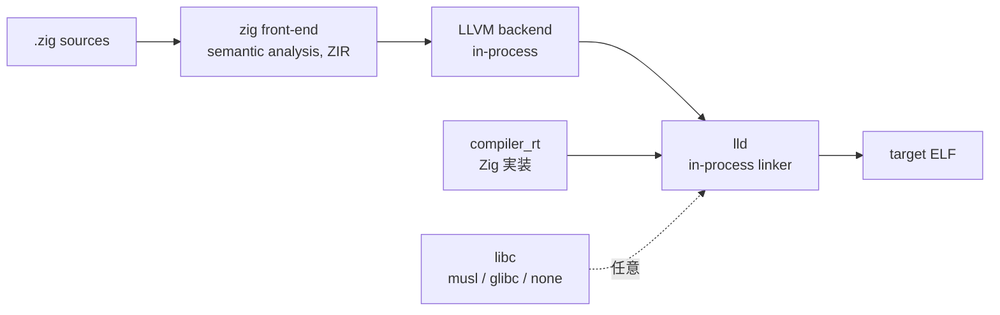

# Chapter 03: Zig 0.16 のクロスコンパイル基盤

## 学習目標

- 「Zig が `riscv-none-elf-gcc` 無しで RISC-V バイナリを吐ける」のは何故かを説明できる
- LLVM バックエンド / lld / compiler_rt が Zig の中でどう連携しているかを掴む
- 本プロジェクトで `linkage = .static` / `link_libc = false` / `bundle_compiler_rt = true` を選んでいる理由を理解する
- セクションごとの GC (`link_gc_sections` 系) がコードサイズに効く仕組みを知る

---

## ふつうの組み込みクロス開発との違い

C/C++ で CH32V003 を開発する場合、典型的にはこんな依存が必要だ。

- `riscv-none-elf-gcc` (もしくは `riscv64-unknown-elf-gcc` などの multilib 版)
- `riscv-none-elf-binutils` (`ld`, `objcopy`, `nm`, `objdump`, `size`)
- 同じツールチェイン用の `newlib` / `libgcc`

これらを揃えてはじめて、 ホスト OS (Mac/Linux/Windows) 上で CH32V003 向けの ELF を作れるようになる。 つまり、開発機ごとに「数百 MB のクロスツールチェイン」を入れる必要がある。

一方、本プロジェクトは **`zig` 単体しか要求しない**（書き込みのための `minichlink` を除けば）。 これは Zig という言語の処理系設計に由来する性質だ。

---

## Zig のコンパイラ構成

`zig` バイナリは、雑に分解するとこういう部品で構成されている。



ここで効いてくるポイントは:

1. **LLVM が Zig コンパイラに同梱**されている。 外部の `clang` / `gcc` を呼び出すのではなく、`zig` プロセス内部で LLVM の IR を直接生成 → コード生成する
2. **`lld` も同梱**。 GNU `ld` を呼ばずに、Zig の中でリンクまで完結する
3. **`compiler_rt` は Zig 自前実装**。 32-bit 乗除算ヘルパ (`__mulsi3`, `__divsi3`) などを **Zig で書き直したもの**を、ターゲットに合わせて `--target=riscv32-...` でコンパイルして埋め込む
4. **libc は任意**。 OS のあるターゲットなら musl / glibc / mingw を埋め込めるが、`link_libc = false` ならそもそもリンクしない

結果として、ホスト OS 用の `zig` を 1 本入れさえすれば、

- macOS 用の `x86_64-macos`
- Linux 用の `aarch64-linux-musl`
- Windows 用の `x86_64-windows-gnu`
- MCU 用の `riscv32-freestanding-eabi` ← **今回これ**

…のいずれもクロスビルドできる。CH32V003 向けに特別なクロスツールチェインを入れなくてよい根拠はここにある。

---

## RISC-V バックエンドが選ばれる流れ

第 2 章で作った `Target.Query` は、最終的に LLVM のターゲットトリプル + 機能フラグに変換される。

```
riscv32-unknown-none-eabi   -target-feature +c,+e,-i
```

これが LLVM の RISC-V バックエンドに渡ると、 内部で:

- 命令選択 (Instruction Selection) を RV32EC 用に切替
- レジスタアロケータの「使える整数レジスタ集合」を `x0..x15` に制限
- 圧縮命令 (`c.*`) を可能な箇所で出力

といった処理が行われる。Zig 側から見るとこれら全ては「ターゲットフラグを正しく作って渡すだけ」で済む。

---

## `build.zig` で本プロジェクトが行う追加宣言

ターゲットを作ったあとの実行ファイル組み立て部分を抜き出すと、こうなっている。

```zig
const exe = b.addExecutable(.{
    .name = selected.name,
    .root_module = root_module,
    .linkage = .static,
});

exe.step.dependOn(&mkdir_step.step);
exe.bundle_compiler_rt = true;
exe.link_gc_sections = true;
exe.link_function_sections = true;
exe.link_data_sections = true;
exe.setLinkerScript(b.path("src/runtime/linker.ld"));
```

それぞれが MCU 開発でなぜ重要かを 1 行ずつ見ていく。

### `linkage = .static`

動的リンクは MCU には存在しない。 ELF はすべて静的にリンクされ、`.so` / `.dylib` の概念は無い。

### `link_libc = false` (モジュール側で指定)

`root_module` を作るときに `.link_libc = false` を指定している。 freestanding ターゲットなので、`printf` も `malloc` も無く、 標準 C ライブラリの依存は完全に切る。

### `bundle_compiler_rt = true`

第 2 章で触れた通り、CH32V003 は乗除算命令を持たない。 そのため `a * b` のような Zig コードがあると、LLVM は **`__mulsi3` ヘルパへの呼び出しに展開**する。 このヘルパ群が compiler_rt で、Zig が自前で持っている。 `bundle_compiler_rt = true` を指定することで、これらのヘルパが ELF にスタティックに同梱される。

実際、`zig build -Dexample=blinky` 後の ELF の中を覗くと、 `__mulsi3` のような関数シンボルが (使われていれば) 含まれている。 GCC 系で言う `libgcc` の役割をここで Zig が肩代わりしている。

### `link_function_sections` / `link_data_sections` / `link_gc_sections`

これらはセクション粒度の **デッドコード/データ削除** を有効化する。

- `link_function_sections = true` → 関数ごとに別セクション (`.text.func_name`) として出力する
- `link_data_sections = true` → グローバル変数ごとに別セクション (`.data.var_name`) として出力する
- `link_gc_sections = true` → リンカに「参照されていないセクションは捨てて良い」と教える

3 つを揃えてはじめて、リンカは「最終的に使われていない関数 / 変数」 単位でファームウェアから取り除ける。 16KB の FLASH に対しては効果が大きく、SSD1306 のフォント 2KB を含んだ `oled` サンプルでも実装によっては fits in できるのは、 ある程度この GC が効いているおかげだ。

### `setLinkerScript`

LLD に対し、独自のリンカスクリプト (`src/runtime/linker.ld`) を渡している。 これが無いと、LLD はデフォルトのスクリプトで `.text` を `0x0000_0000` から配置しようとしてしまい、CH32V003 の FLASH 配置 (`0x0800_0000` 開始) と合わない。 リンカスクリプトについては第 4 章で詳しく見る。

---

## ホスト依存を極力減らす設計

それでも `build.zig` 内に残っているホスト依存は次の通り:

| 用途 | 呼び出し先 | 必須か |
|---|---|---|
| `mkdir -p zig-out/firmware` | システムの `mkdir` | 実質必須 (どの POSIX 環境にもある) |
| `.lst` 生成 | `llvm-objdump` or `riscv-none-elf-objdump` | **任意** (生成しなくてもファームウェアは作れる) |
| `.map` 生成 | `llvm-nm` or `riscv-none-elf-nm` | **任意** |
| `size` ターゲット | `llvm-size` or `riscv-none-elf-size` | **任意** |
| `flash` ターゲット | `tools/flash.sh` → `minichlink` | 書き込み時のみ必須 |

`.elf` / `.bin` / `.hex` を生成する **本筋のビルドには Zig しか要らない**。 `disasm` / `mapfile` / `size` は **オプトインのステップ** として切り出してあり、 LLVM ツール群が無くてもデフォルトビルドは失敗しないように `build.zig` を構成している。

---

## まとめ

- Zig は LLVM と lld を同梱しており、追加の RISC-V GCC 系ツールチェインを必要としない
- 乗除算など RV32EC が持たない命令の補完は、Zig 製の `compiler_rt` を `bundle_compiler_rt` で同梱することで賄う
- `link_function_sections` + `link_data_sections` + `link_gc_sections` で「使われていない部品」を削れるようにしてある
- ホスト依存は「書き込み用の minichlink」と「任意の LLVM/GNU ツール」だけに絞ってあり、 ELF 生成までは `zig` 単体で完結する

次章では、LLD に渡している `linker.ld` の中身を読み解き、 FLASH と RAM の物理アドレスにコードとデータがどう配置されるかを追っていく。
