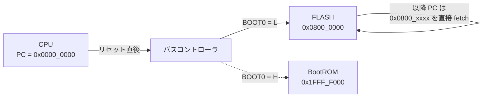

# Chapter 04: メモリマップとリンカスクリプト

## 学習目標

- CH32V003 の物理メモリ配置 (FLASH / SRAM の番地) を把握する
- `src/runtime/linker.ld` の `MEMORY` / `SECTIONS` がそれぞれ何を決めているのか説明できる
- `.data` を「FLASH に置きつつ RAM の番地で解決する」テクニック (`AT >`) を読み解ける
- `_sdata` / `_edata` / `_sbss` / `_ebss` / `_sidata` / `_stack_top` のシンボルが何のために露出されているのかを理解する

---

## CH32V003 の物理メモリマップ (要点)

| 領域 | 番地 | サイズ | 用途 |
|---|---|---|---|
| FLASH | `0x0800_0000`〜 | 16 KB | プログラムコード / 定数 / `.data` の初期値 |
| SRAM  | `0x2000_0000`〜 | 2 KB  | スタック / グローバル変数 (`.data` / `.bss`) |
| 周辺レジスタ | `0x4000_0000`〜 | — | RCC, GPIO, I2C, ... |
| コア内蔵周辺 | `0xE000_0000`〜 | — | PFIC, SysTick |

このうち、リンカスクリプトが直接決めるのは **FLASH と SRAM の使い方** だ。 周辺レジスタは MMIO として MCU の物理配線で決まっているので、 ソフト側からはアドレス即値として参照するだけになる (詳細は第 10 章)。

---

## FLASH 領域より前 (`0x0000_0000`〜) には何があるのか

第 1 章のメモリマップでは「FLASH は `0x0800_0000` から」と書いた。 だが RISC-V のリセットベクタは **`0x0000_0000`** から始まるのが普通だ。 では `0x0000_0000` 〜 `0x07FF_FFFF` の 128 MB 弱はいったい何のために空けてあるのか — これを知らずにメモリマップを眺めると、 「リセットしたのになぜ `0x0800_0000` のコードが走るのか」 が説明できない。

CH32V003 (および STM32 / GD32 系) では、 この領域は **「ブートエイリアス」** という仕組みで使われている。

### ブートエイリアスとは

```
リセット直後の CPU       :  PC = 0x0000_0000 から fetch
                              ↓ ハードウェアが透過的にリダイレクト
実際にアクセスされる場所  :  FLASH (0x0800_0000) または BootROM (0x1FFF_F000)
                              ↑ どちらにエイリアスするかは BOOT0 ピンで決まる
```

つまり `0x0000_0000` の領域は、**それ自体には物理的な記憶素子が無く**、 別の領域への「鏡像 (alias)」として現れる。 リセット時に CPU は `0x0000_0000` を読みに行くが、 アドレスバスに `0x0000_0000` が出た瞬間、 メモリコントローラがそれを「BOOT0 が L なら `0x0800_0000` (FLASH)」 「BOOT0 が H なら `0x1FFF_F000` (BootROM)」 にすり替えてアクセスを返す。

CH32V003 の典型的な配置 (BOOT0 = L) では以下のようになる。

| 領域 | 番地レンジ | サイズ | 役割 |
|---|---|---|---|
| **Boot alias** | `0x0000_0000`〜`0x0000_3FFF` | 16 KB | リセットベクタからの fetch を FLASH または BootROM にエイリアス |
| 予約 (未マップ) | `0x0000_4000`〜`0x07FF_FFFF` | ≒ 128 MB | アクセスするとバスフォールト |
| **FLASH** | `0x0800_0000`〜`0x0800_3FFF` | 16 KB | 本書で扱うコード/データの本体 |
| 予約 | `0x0800_4000`〜`0x1FFF_EFFF` | — | 未マップ |
| **System Memory (BootROM)** | `0x1FFF_F000`〜`0x1FFF_F7FF` | 1.92 KB | WCH が工場で書き込んだ ISP ブートローダ。 USART などからの再書き込み経路を持つ |
| **Option bytes** | `0x1FFF_F800`〜`0x1FFF_F80F` | 16 B | リードプロテクション (RDPR)、 ユーザフラグ、 WDG モード |
| **Factory trim 等** | `0x1FFF_F7D4` | 1 B | HSI クロックの工場校正値 (本プロジェクトは `CFG0_PLL_TRIM` でこの番地を読んでいる) |
| 予約 | `0x1FFF_F810`〜`0x1FFF_FFFF` | — | 未マップ |

### BOOT0 ピンと「どこへエイリアスされるか」

| BOOT0 | エイリアス先 | 何が起きるか |
|---|---|---|
| **L (GND)** | FLASH (`0x0800_0000`) | 通常運用。 リセットすると FLASH のユーザコードから起動 |
| **H (VCC)** | System Memory (`0x1FFF_F000`) | WCH BootROM が起動。 USART 等経由で FLASH を書き換える ISP モードに入れる |

`minichlink` を使う書き込みでは BOOT0 を H にする必要が無い。 SWIO 経由でデバッグ機能を握って FLASH を直接書き換えるためだ。 一方、 SWIO アダプタが無い環境で「最初の書き込み」を行いたい場合は BOOT0 を H にして BootROM を起こし、 シリアル ISP を使う、 という選択肢が残されている。

### startup から見た風景

第 5 章で見る startup コードは、 これらを意識せず常に `0x0800_xxxx` の番地で動いているように振る舞う。 これはリンカスクリプトが:

```ld
FLASH (rx) : ORIGIN = 0x08000000, LENGTH = 16K
```

と宣言し、 全てのリンク解決が **`0x0800_0000` 基準** で行われるからだ。 リセット時の `0x0000_0000` fetch はあくまでハードの透過処理であって、 ソフトウェアから見えるアドレスは最初から `0x0800_xxxx` になる。



### 「予約領域」 を踏むとどうなる

`0x0000_4000` 〜 `0x07FF_FFFF` や `0x0800_4000` 〜 `0x1FFF_EFFF` のような未マップ領域に load/store すると、 CH32V003 では **バスフォールト (例外)** が発生する。 ベクタテーブルの 3 番 (Exception) に飛ぶので、 本プロジェクトのデフォルトでは `_default_irq_entry` 経由で `wfi` ループに落ちる (第 6 章)。

つまり、 ヌルポインタ参照 (`*ptr = 0` で `ptr == null`) のような事故は、 アドレス的には未マップ領域の `0x0000_0000` 近傍を踏みに行くため、 「無事故では済まない」 形で必ず観測できる、 ということでもある。 デバッグ時の保険として悪くない挙動。

### 工場 trim を使っている例

CH32V003 は内蔵 HSI (高速 RC オシレータ) のキャリブレーション値を **`0x1FFF_F7D4`** に持っている。 本プロジェクトの `src/system/system.zig` がそれを読み出して RCC.CTLR に書き戻すコードを含む:

```zig
const trim: *volatile u8 = @ptrFromInt(regs.CFG0_PLL_TRIM);
if (trim.* != 0xFF) {
    const old = rcc.CTLR;
    rcc.CTLR = (old & ~(@as(u32, 0x1F) << 3)) | (@as(u32, trim.* & 0x1F) << 3);
}
```

`CFG0_PLL_TRIM` は:

```zig
pub const CFG0_PLL_TRIM: usize = 0x1FFFF7D4;
```

として `src/periph/registers.zig` に定義されている。 ここはまさに「Option/Factory 領域」 — FLASH 本体 (`0x0800_0000`) ではなく BootROM 近傍にある工場ROMで、 ユーザは読み取り専用で使う番地だ。

---

## `src/runtime/linker.ld` 全体像

```ld
MEMORY
{
    FLASH (rx) : ORIGIN = 0x08000000, LENGTH = 16K
    RAM (rwx)  : ORIGIN = 0x20000000, LENGTH = 2K
}

SECTIONS
{
    .vector_table :
    {
        . = ALIGN(4);
        KEEP(*(.vector_table))
        . = ALIGN(4);
    } > FLASH

    .text :
    {
        . = ALIGN(4);
        *(.text .text.*)
        *(.rodata .rodata.*)
        . = ALIGN(4);
    } > FLASH

    .data :
    {
        . = ALIGN(4);
        _sdata = .;
        *(.data .data.*)
        *(.sdata .sdata.*)
        . = ALIGN(4);
        _edata = .;
    } > RAM AT > FLASH

    _sidata = LOADADDR(.data);

    .bss (NOLOAD) :
    {
        . = ALIGN(4);
        _sbss = .;
        *(.bss .bss.*)
        *(.sbss .sbss.*)
        *(COMMON)
        . = ALIGN(4);
        _ebss = .;
    } > RAM

    PROVIDE(__global_pointer$ = ORIGIN(RAM) + 0x800);
    PROVIDE(_stack_top = ORIGIN(RAM) + LENGTH(RAM));

    /DISCARD/ :
    {
        *(.eh_frame*)
        *(.comment)
        *(.note*)
    }
}
```

ブロックごとに読み解いていく。

---

## `MEMORY` — 物理領域の宣言

```ld
MEMORY
{
    FLASH (rx) : ORIGIN = 0x08000000, LENGTH = 16K
    RAM (rwx)  : ORIGIN = 0x20000000, LENGTH = 2K
}
```

- `FLASH` は **読み・実行可能** (`rx`)。書き込みはアプリ実行時には行わない。
- `RAM` は **読み・書き・実行可能** (`rwx`) ― CH32V003 の SRAM は実行可能領域でもあるが、本プロジェクトでは RAM 上にコードを置く構成は採っていない。
- サイズが嘘 (LENGTH の指定が実機より大きい) だとリンカが超過を見逃すので、ここは正確に書く必要がある。

`LENGTH = 16K` を超えるとリンクが失敗するので、 これは「16K に収まっているか」のセーフティネットとしても働く。

---

## `.vector_table` — ベクタテーブルを FLASH 先頭に置く

```ld
.vector_table :
{
    . = ALIGN(4);
    KEEP(*(.vector_table))
    . = ALIGN(4);
} > FLASH
```

- `KEEP(...)` を付けないと、 第 3 章で有効化した `--gc-sections` が「どこからも呼ばれていない」と判断して 削除してしまう。 ベクタテーブルはハードが暗黙に参照するため、リンカに「これは残せ」と指示する必要がある。
- 配置順序の通り、`.text` より前にあるので、 `.vector_table` は **FLASH の先頭 `0x0800_0000`** に居座る。
- これは CH32V003 のリセット時の挙動とも整合する。リセット時、コアは `mtvec` から間接的にハンドラを引くため、ベクタテーブルがどこに居るかは「`mtvec` に書いたアドレス」で決まるのだが、 配置を予測しやすくする意味でも先頭固定にしている。

---

## `.text` — コードと定数

```ld
.text :
{
    . = ALIGN(4);
    *(.text .text.*)
    *(.rodata .rodata.*)
    . = ALIGN(4);
} > FLASH
```

- `.text` (実行コード) と `.rodata` (読み取り専用データ、定数文字列など) をまとめて FLASH に積む。
- `*(.text.*)` というワイルドカードは、第 3 章で有効化した `function_sections` の出力 (`.text.main`, `.text.delayMs`, ...) を全部すくい上げるためのもの。
- ここに居るバイトは、書き込み後そのままの番地で CPU が読みに行く。

---

## `.data` — 「FLASH に置いて RAM の番地でリンクする」トリック

```ld
.data :
{
    . = ALIGN(4);
    _sdata = .;
    *(.data .data.*)
    *(.sdata .sdata.*)
    . = ALIGN(4);
    _edata = .;
} > RAM AT > FLASH

_sidata = LOADADDR(.data);
```

ここが最初に見ると混乱しやすいので順を追って解く。

### 何が起きているか

`.data` セクションには「初期値を持ったグローバル変数」が入る。 たとえば `var x: u32 = 0x12345678;` のように初期値があるもの。

このセクションは、**実行時には RAM に存在しないといけない** (書き換え可能なので)。 しかし **初期値そのものは FLASH に置いておかなければならない** (電源を切ったら RAM は消えるので)。

これを解決するのが `> RAM AT > FLASH` だ。

- `> RAM` は **VMA (Virtual Memory Address)**。 「実行時にこの番地にあるものとしてリンクする」 — つまりコードは `0x2000_0000` 系の番地を見にいく。
- `AT > FLASH` は **LMA (Load Memory Address)**。 「実体は FLASH に書き込まれる」 — つまり ELF ローダや書き込みツールは `0x0800_xxxx` の場所にバイトを置く。

実機リセット直後では「コードは RAM 番地を期待するが、その RAM 番地はまだ未初期化」という状態になる。 そこで起動時に **FLASH 上の初期値を RAM にコピーする** 必要がある (これが startup の `copyData()` の仕事 — 第 5 章で詳述)。

### 露出されるシンボル

| シンボル | 意味 |
|---|---|
| `_sdata` | `.data` の **RAM 上の開始番地** |
| `_edata` | `.data` の **RAM 上の終端番地** |
| `_sidata` | `.data` の **FLASH 上の開始番地** (LOADADDR が返す LMA) |

startup コードはこの 3 つを参照して、`[_sidata, _sidata + (_edata - _sdata))` の FLASH 内容を `[_sdata, _edata)` の RAM へコピーする。

---

## `.bss` — 初期値ゼロの領域

```ld
.bss (NOLOAD) :
{
    . = ALIGN(4);
    _sbss = .;
    *(.bss .bss.*)
    *(.sbss .sbss.*)
    *(COMMON)
    . = ALIGN(4);
    _ebss = .;
} > RAM
```

- 「初期値が 0」の変数は ELF にバイト列として書く必要がない。 ELF 上では `.bss` は領域だけ確保し、中身は持たない (`NOLOAD` の意味)。
- 実行時には RAM 上に存在する必要があるので、 startup でこの範囲を **0 で埋める** 仕事を行う (`zeroBss()`)。
- `_sbss` / `_ebss` がそのために露出される。

---

## グローバルポインタとスタックトップ

```ld
PROVIDE(__global_pointer$ = ORIGIN(RAM) + 0x800);
PROVIDE(_stack_top = ORIGIN(RAM) + LENGTH(RAM));
```

### `__global_pointer$`

RISC-V には、 グローバル変数アクセスをコンパクトな命令にエンコードするための **`gp` レジスタ最適化** がある (Linker Relaxation の一種)。 `gp` レジスタを「RAM の先頭 + 0x800」に向けると、 そこから ±2KB の範囲のグローバル変数を 12-bit オフセット 1 命令でアクセスできるようになる。

2KB の RAM をフルに使うため、 RAM 先頭から +0x800 (= 2048) を指して中心に据えるのが慣例。 startup の `_start` で:

```asm
.option norelax
la gp, __global_pointer$
.option pop
```

として、自身の参照を Linker Relaxation から除外しつつロードしている。 (`.option norelax` を挟まないと、「`gp` を `gp` 相対でロードする」という循環論法になりかねないため)

### `_stack_top`

スタックは RAM の最後尾から下に伸びる慣例なので、 RAM の末尾を指すシンボルを `_stack_top` として露出する。 起動時の `la sp, _stack_top` でここを `sp` に積めば、 以降のスタック push がアドレスを減らしながら使われる。

---

## `/DISCARD/` — 要らないものを捨てる

```ld
/DISCARD/ :
{
    *(.eh_frame*)
    *(.comment)
    *(.note*)
}
```

例外ハンドリング情報やビルド時のメタデータは、 ファームウェアバイナリに乗せる必要がない。 明示的に `/DISCARD/` に流して、 FLASH を節約する。

---

## 配置のイメージ

```
FLASH (0x0800_0000):
+--------------------------+ 0x0800_0000
|       .vector_table      |
+--------------------------+
|          .text           |
|          .rodata         |
+--------------------------+
|  .data の初期値 (LMA)     |
+--------------------------+ <- 16KB 以内に収まる
                            <  LOADADDR(.data) == _sidata

SRAM (0x2000_0000):
+--------------------------+ 0x2000_0000   <- _sdata
|         .data            |
+--------------------------+               <- _edata
|         .bss             |
+--------------------------+               <- _ebss
|          ...             |
|       (free space)       |
|          ...             |
|        ↑ stack ↓         |
+--------------------------+ 0x2000_0800   <- _stack_top
```

---

## まとめ

- `MEMORY` で FLASH / RAM の物理配置を宣言し、`SECTIONS` で各セクションをそこに割り当てる
- `.vector_table` は `KEEP` でリンカ GC から守り、FLASH 先頭に配置
- `.data` は **VMA = RAM / LMA = FLASH** で「初期値は FLASH、本体は RAM」を表現
- `.bss` は `NOLOAD` で実体を持たず、起動時に 0 クリア
- `__global_pointer$` と `_stack_top` を露出し、起動コードが `gp` / `sp` を立てる足場にする

次章では、これらシンボルを実際に使って **「リセット直後に C/Zig コードが動ける状態を作るまで」** の起動コードを読んでいく。
