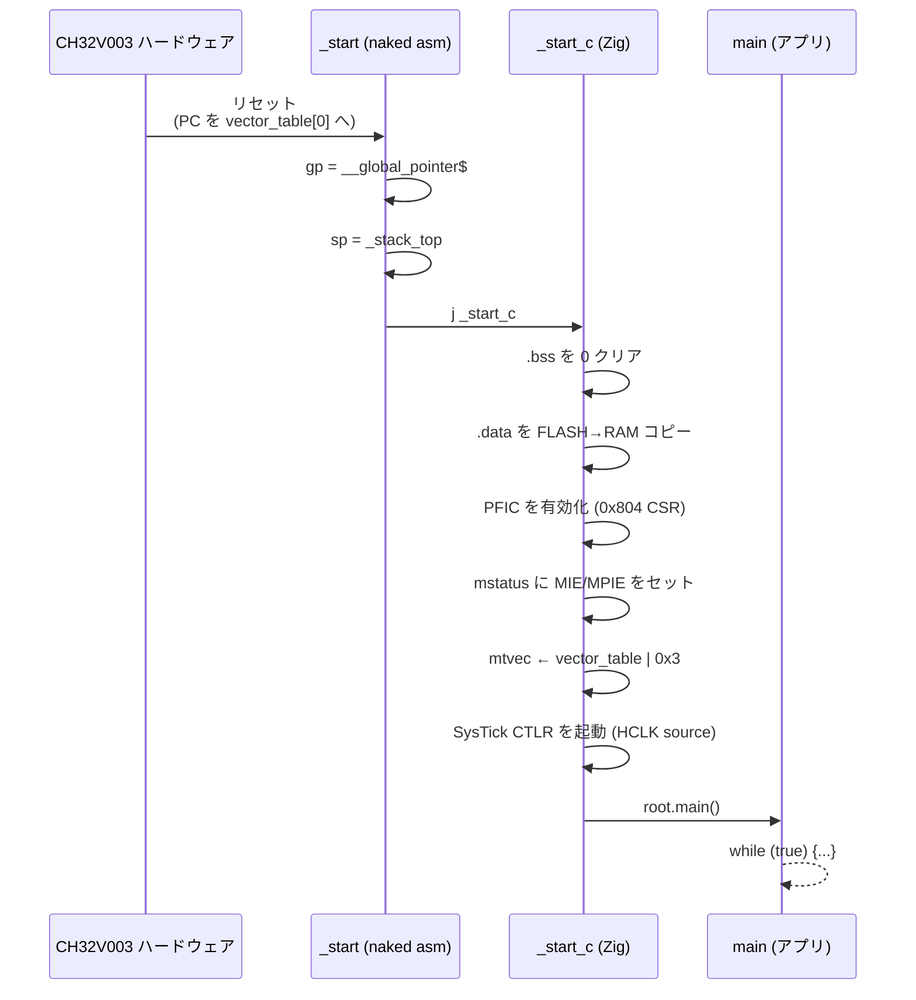

# Chapter 05: 起動コードとランタイム初期化

## 学習目標

- `src/runtime/startup.zig` の `_start` / `_start_c` がそれぞれ何を担当しているかを読み解ける
- `callconv(.naked)` と `callconv(.c)` の使い分けを理解する
- リセット直後に **gp / sp / .data / .bss / mtvec / mstatus** をどう整えていくか順を追える
- なぜ `extern var _sbss: u32;` のような外部宣言で良いのかを理解する
- 最終的にユーザの `main()` に制御が渡るまでの一連の流れを把握する

---

## 起動シーケンスの全体像

CH32V003 がリセットされてから、`examples/blinky/main.zig` の `main()` が走り出すまでには、 大きく次のステップが挟まる。



ハードウェアそのものが面倒を見てくれるのは「PC を vector_table[0] にセットする」 (= `_start` に飛ばす) ところまで。 そこから先は全部ソフトウェアの仕事である。

---

## `_start` — naked エントリポイント

```zig
pub export fn _start() callconv(.naked) noreturn {
    asm volatile (
        \\.option push
        \\.option norelax
        \\la gp, __global_pointer$
        \\.option pop
        \\la sp, _stack_top
        \\j _start_c
    );
}
```

### `callconv(.naked)` が要る理由

通常の関数を生成すると、コンパイラはプロローグ (フレームポインタの保存、スタック確保) を必ず挟む。 ところが「`sp` がまだ立っていない時点で走る関数」では、 スタックに何かを push する自動コードが入った瞬間に死ぬ。

`callconv(.naked)` は「プロローグ / エピローグを一切生成するな」という指示で、 関数の中身は完全に開発者が書く **生のアセンブリ** になる。

### `gp` を立てる — `.option norelax`

```asm
.option push
.option norelax
la gp, __global_pointer$
.option pop
```

`la` は擬似命令で、通常はリンカが「`auipc + addi`」へ展開する。 さらに RISC-V のリンカは、`gp` 相対でアクセスできるシンボルは `auipc/addi` ではなく **`addi gp,gp,offset` 1 命令に縮める** リラックス処理を行う。

ところがここで縮めると、 「`gp` の値を `gp` 相対で求める」という循環が発生してしまう。 そこでこのブロックだけ `.option norelax` で囲い、 通常の `auipc + addi` 展開のままにしておく。

ペアになっている `.option push` / `.option pop` は、 オプションのスコープを「この命令ペアの間だけ」に閉じ込めるための定石。

### `sp` を立てる

```asm
la sp, _stack_top
```

リンカスクリプトで露出した `_stack_top` (= RAM 末尾) を `sp` にロードする。 これでスタックが「RAM の上端から下に伸びる」状態になり、 以降は普通のスタック push が安全になる。

### `j _start_c`

ここで初めて普通の C/Zig 関数 (`_start_c`) にジャンプする。 `call` ではなく `j` (= 単純なジャンプ) を使うのは、 戻る必要がない (= スタックフレームを残す必要がない) からだ。 ここで戻り先を `ra` に積むと、スタックフレームの整合性に気を使う必要が生じる。

---

## `_start_c` — Zig 側の初期化本体

```zig
export fn _start_c() callconv(.c) noreturn {
    zeroBss();
    copyData();

    setupMachineState();

    // Start free-running SysTick (HCLK source) for delay API.
    regs.systick().CTLR = regs.SYSTICK_CTLR_STE | regs.SYSTICK_CTLR_STCLK;

    root.main();
}
```

`callconv(.c)` を付けているので、 通常通り Zig コンパイラがプロローグ / エピローグを生成する。 `sp` がもう立っているので、ローカル変数を取っても問題ない。

順に追っていく。

### `zeroBss()` — `.bss` を 0 にする

```zig
extern var _sbss: u32;
extern var _ebss: u32;

fn zeroBss() void {
    var p: [*]volatile u32 = @ptrCast(&_sbss);
    const end: [*]volatile u32 = @ptrCast(&_ebss);
    while (@intFromPtr(p) < @intFromPtr(end)) : (p += 1) {
        p[0] = 0;
    }
}
```

ここで使っているテクニックは:

- **`extern var _sbss: u32;`** — リンカが定義するシンボルは「型は問わずアドレスだけ欲しい」場合が多い。 Zig では `extern var` として **適当な型** で宣言し、 `&_sbss` で「そのシンボルの番地」を取り出す。 値そのものは読まないので、`u32` でも何でも良い。
- **`[*]volatile u32`** — 「`volatile u32` の不定長配列ポインタ」を表す Zig の型。 C で言う `volatile uint32_t *`。 メモリへの書き込みが最適化で消えないようにするために `volatile` を付ける。
- **4 バイト単位ループ** — リンカで `_sbss` / `_ebss` をどちらも 4 アラインに揃えているので、 1 ワードずつ書き込むだけで取りこぼしがない。

### `copyData()` — `.data` の初期値を RAM に展開

```zig
extern var _sdata: u32;
extern var _edata: u32;
extern var _sidata: u32;

fn copyData() void {
    var src: [*]const u32 = @ptrCast(&_sidata);
    var dst: [*]volatile u32 = @ptrCast(&_sdata);
    const end: [*]volatile u32 = @ptrCast(&_edata);
    while (@intFromPtr(dst) < @intFromPtr(end)) : ({
        src += 1;
        dst += 1;
    }) {
        dst[0] = src[0];
    }
}
```

第 4 章の `> RAM AT > FLASH` で作った「FLASH 上の `.data` 実体」を RAM 上の `.data` 番地にコピーする。 リンカが用意したシンボルがそのまま実行時アドレスとして使える。

これが終わるまでは、 初期値付きグローバル変数 (`var counter: u32 = 100;` のようなもの) は **未定義値** を持つことになる。 つまり、ユーザの `main()` で `counter` を読むより前にこの関数が走り終わっている必要がある。 順序を守るのが `_start → _start_c → main` の構成の役目。

### `setupMachineState()` — マシン状態レジスタを整える

```zig
fn setupMachineState() void {
    const mtvec_addr: usize = @intFromPtr(&vector_table) | 0x3;

    asm volatile ("li t0, 0x03; csrw 0x804, t0" ::: .{ .t0 = true });
    asm volatile ("csrs mstatus, %[bits]"
        :
        : [bits] "r" (@as(u32, 0x88)),
        : .{ .memory = true });
    asm volatile ("csrw mtvec, %[vec]"
        :
        : [vec] "r" (@as(u32, @truncate(mtvec_addr))),
        : .{ .memory = true });
}
```

3 つの CSR (Control and Status Register) を順に弄っている。

#### `csrw 0x804, 0x03` — WCH 拡張 `INTSYSCR` の有効化

`0x804` は標準 RISC-V には存在しない、 **WCH (CH32V) 独自の CSR (INTSYSCR)**。 ビット 0/1 を立てることで、 PFIC のハードウェアスタッキングや割り込みネスティングなど、 ベンダ固有の挙動を有効化している。 ここはチップマニュアルを読まないと意味が取れない領域なので、 おまじないとして覚えておけば十分だ。

#### `csrs mstatus, 0x88` — MIE と MPIE をセット

- ビット 3 (`MIE`) — 機械モード割り込み有効
- ビット 7 (`MPIE`) — `mret` 復帰時に MIE に積み戻される値

両方立てておくことで、リセット後から割り込みを受け取れる状態になる。 ただし PFIC 側の有効化は個別の周辺ドライバが行う。

#### `csrw mtvec, vector_table | 0x3`

`mtvec` は「割り込み / 例外発生時に PC を飛ばす先」のベース。 下位 2 ビットはモードビットで、 `0b11` は **ベクタード + ハードウェアスタッキング** モード (WCH 拡張)。

`mtvec = &vector_table | 0x3` とすることで、 割り込みベクタごとに別ハンドラへ飛ばすモードが選ばれる。 ベクタテーブル本体は次章で見る。

### SysTick を起動

```zig
regs.systick().CTLR = regs.SYSTICK_CTLR_STE | regs.SYSTICK_CTLR_STCLK;
```

- `STE` — SysTick 有効
- `STCLK` — クロックソースを HCLK (システムクロック)に

これで SysTick の `CNT` が自走を始める。 割り込みを使わない (`delayMs` のような) 用途ではこれだけで十分で、 周期割り込みが欲しければ `hal/time.zig` の `systick.init` を別途呼ぶ。

### `root.main()` — ユーザコードへ

```zig
const root = @import("root");
...
root.main();
```

Zig の `@import("root")` は **ルートソースファイル** (= `addExecutable` で渡した `.root_source_file`、 つまり `examples/<name>/main.zig`) を指す。 そこから `main` を呼べば、 アプリ側のループに制御が移る。

各 example は次のような `main` シグニチャを持っている。

```zig
// examples/blinky/main.zig
pub export fn _start() noreturn {
    main();
}

pub fn main() noreturn {
    fun.system.init(.{});
    fun.gpio.enableAllClocks();
    const led = fun.gpio.pin(.D, 0);
    led.configure(.output_pp_10mhz);
    while (true) {
        led.toggle();
        fun.time.delayMs(250);
    }
}
```

> ⚠️ ここで `pub export fn _start() noreturn` がアプリ側にも出てくるのが少しややこしい。 これは startup の `_start` (naked) とは別物で、 各 example の `main` を呼ぶための **薄いラッパ** として書かれている。 実際に呼ばれるのは `src/runtime/startup.zig` の `_start` 側 (vector_table[0] が向いている方) であり、 アプリ側の `_start` は使われない。 過去経緯で残っている薄皮なので、 整理対象の余地はある。

---

## なぜこの順序が大事なのか

| ステップ | これより前にやれない仕事 |
|---|---|
| `gp` を立てる | `gp` 相対アクセスを含むコード全般 |
| `sp` を立てる | スタックフレームを持つ関数呼び出し全般 |
| `.bss` を 0 クリア | 「初期値ゼロ」を前提にする静的変数 |
| `.data` を RAM にコピー | 初期値付き静的変数の読み出し |
| `mtvec` 設定 | 割り込みを発生させても安全に飛べる |
| PFIC / `mstatus` 設定 | 割り込み許可後の周辺ドライバ初期化 |
| SysTick 起動 | `delayMs` ベースのタイミング処理 |

つまり、ハードウェアからソフトウェアへの「橋渡し」を 1 ステップずつ整えていくのが startup の役目だ。 順番を 1 個飛ばすと、 たいてい「とりあえず動くけど時々おかしい」 という最悪のバグ群に出会うことになる。

---

## まとめ

- `_start` は `callconv(.naked)` で書かれた純粋なアセンブリ。 `gp` と `sp` を立てて、すぐに `_start_c` にジャンプする
- `_start_c` は Zig の通常関数として、`.bss` ゼロクリア → `.data` コピー → CSR セットアップ → SysTick 起動 → `root.main()` を順番に行う
- `extern var _sbss: u32;` のような Zig の宣言で、 リンカが用意したシンボルのアドレスを取り出す
- 起動コードは「ハードウェアが整えていない前提を、ソフトで埋めていく」ための階段

次章では、`mtvec` から参照されるベクタテーブルがどう作られていて、 SysTick 割り込みのコンテキスト退避が何バイトの何で構成されているかを見ていく。
