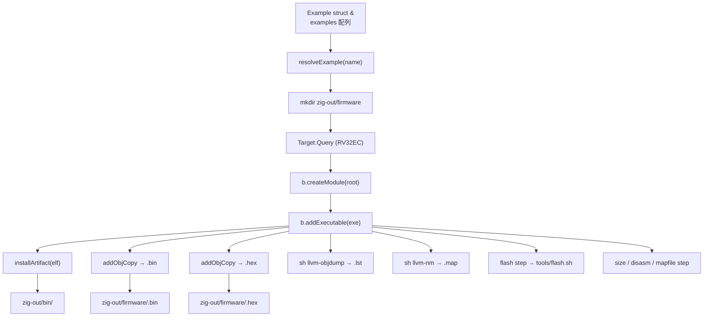
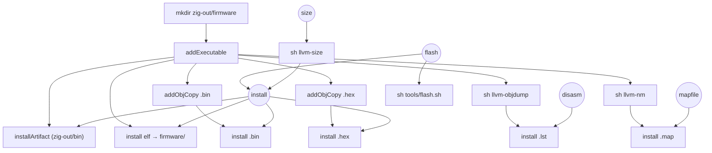

# Chapter 07: build.zig をひと通り歩く

## 学習目標

- 本プロジェクトの `build.zig` の全体構造をざっくり把握する
- `-Dexample=<name>` でサンプルを切り替える機構の作りを読み解く
- `b.createModule` → `b.addExecutable` → `b.installArtifact` の流れを追える
- ステップグラフの依存関係 (mkdir → exe → objcopy → install → flash) を理解する

---

## ファイル全体マップ

`build.zig` は概ね以下のブロックで構成されている。



このうち、第 2/3 章で **D〜F** (ターゲット指定とコンパイラ呼び出し) を扱ったので、 本章では残りの周辺整備 (A〜C と G〜Q) を読んでいく。

---

## サンプル選択の作り

```zig
const Example = struct {
    name: []const u8,
    path: []const u8,
};

const examples = [_]Example{
    .{ .name = "blinky", .path = "examples/blinky/main.zig" },
    .{ .name = "gpio_input", .path = "examples/gpio_input/main.zig" },
    .{ .name = "timer_irq", .path = "examples/timer_irq/main.zig" },
    .{ .name = "oled", .path = "examples/oled/main.zig" },
};

fn resolveExample(name: []const u8) ?Example {
    inline for (examples) |example| {
        if (std.mem.eql(u8, name, example.name)) return example;
    }
    return null;
}
```

- **`examples` を `build.zig` 内のコンパイル時データとして持つ**ことで、サンプル追加時の手当ては「ここに 1 行足す」だけで済む。
- `inline for` は `comptime` でループを展開する。 `name` は `[]const u8` (ランタイム値) なので、 展開された各 `if` の `std.mem.eql` はランタイムに走るが、 ループ自体は静的に展開される。

```zig
const example_name = b.option([]const u8, "example", "Example to build") orelse "blinky";
const selected = resolveExample(example_name) orelse {
    std.debug.print("Unknown example '{s}'. Available: blinky, gpio_input, timer_irq, oled\n", .{example_name});
    @panic("invalid example");
};
```

- `b.option([]const u8, "example", ...)` で `-Dexample=<name>` を受け取る。
- 指定が無ければ `blinky` がデフォルト。
- 未知の名前のときは `@panic` で即座に止める。 これは「ビルド設定ミスをサイレントに通さない」ための積極的な失敗。

---

## `mkdir` ステップ

```zig
const mkdir_step = b.addSystemCommand(&.{ "mkdir", "-p", "zig-out/firmware" });
```

`zig-out/firmware/` ディレクトリを事前に作っておくためのステップ。 後続の `addInstallFileWithDir(..., .{ .custom = "firmware" }, ...)` はディレクトリが無くても普通は作れるが、 並列で複数の `addInstallFileWithDir` が走ったり、 `sh llvm-objdump > foo.lst` のシェルリダイレクトでファイルを作るときに、 親ディレクトリの存在が前提になっているケースがあるので、 明示的に先行作成しておく方が嬉しい。

`exe.step.dependOn(&mkdir_step.step);` で「exe をビルドする前に mkdir」 という順序を貼っている。

---

## モジュール → 実行ファイル

```zig
const root_module = b.createModule(.{
    .root_source_file = b.path(selected.path),
    .target = target,
    .optimize = optimize,
    .link_libc = false,
});

const exe = b.addExecutable(.{
    .name = selected.name,
    .root_module = root_module,
    .linkage = .static,
});
```

- **`root_module`** は「ルートソース」「ターゲット」「最適化レベル」「libc を引かない」を持つ Zig モジュールの単位。
- それを `addExecutable` の `.root_module` に渡す。Zig 0.16 のビルド API は「モジュールを作って、それから実行ファイルを作る」というワンクッションを挟む形になっている。
- `linkage = .static` で動的リンクを禁ずる。

### `ch32fun` モジュールの import

```zig
const ch32fun_mod = b.createModule(.{
    .root_source_file = b.path("src/ch32fun.zig"),
});
root_module.addImport("ch32fun", ch32fun_mod);
```

これがあるおかげで、 example 側で:

```zig
const fun = @import("ch32fun");
```

と書けるようになる。 名前解決の正体は「`ch32fun` という名前を `src/ch32fun.zig` に紐付ける」 という単純なマッピングだ。

---

## ELF を install する

```zig
b.installArtifact(exe);

const elf_install = b.addInstallFileWithDir(
    exe.getEmittedBin(),
    .{ .custom = "firmware" },
    b.fmt("{s}.elf", .{selected.name}),
);
b.getInstallStep().dependOn(&elf_install.step);
```

- `installArtifact(exe)` は **デフォルトの場所 `zig-out/bin/<name>` に exe をコピー**する標準ステップ。
- それとは別に、**ELF を `zig-out/firmware/<name>.elf` にも複製**するために `addInstallFileWithDir` を使っている。 `.custom = "firmware"` でサブディレクトリを指定する形式。
- 結果として、ファームウェア関連の成果物は全て `zig-out/firmware/` 配下にまとまる。

---

## objcopy で `.bin` と `.hex` を生成

```zig
const bin = exe.addObjCopy(.{
    .format = .bin,
    .basename = b.fmt("{s}.bin", .{selected.name}),
});
const bin_install = b.addInstallFileWithDir(
    bin.getOutput(),
    .{ .custom = "firmware" },
    b.fmt("{s}.bin", .{selected.name}),
);
b.getInstallStep().dependOn(&bin_install.step);
```

- **`exe.addObjCopy({ .format = .bin })`** は Zig が内部で `objcopy` 相当の処理を行うステップを作る。 外部の `llvm-objcopy` を呼んでいるわけではなく、 Zig が ELF を読んで Intel HEX や raw binary に変換する処理を持っている。
- `.bin` (Raw) は `minichlink` への書き込みで使う。
- `.hex` (Intel HEX) は他のツール (ISP プログラマ等) と互換させたいとき用。

詳しい話は次章 (objcopy) に回す。

---

## `.lst` と `.map` のオプトイン生成

```zig
const lst_cmd = b.addSystemCommand(&.{
    "sh",
    "-c",
    "if command -v llvm-objdump >/dev/null 2>&1; then llvm-objdump -d \"$1\" > \"$2\"; else riscv-none-elf-objdump -d \"$1\" > \"$2\"; fi",
    "sh",
});
lst_cmd.addFileArg(exe.getEmittedBin());
const lst_file = lst_cmd.addOutputFileArg(b.fmt("{s}.lst", .{selected.name}));
const lst_install = b.addInstallFileWithDir(lst_file, .{ .custom = "firmware" }, b.fmt("{s}.lst", .{selected.name}));
lst_install.step.dependOn(&lst_cmd.step);
```

- **`addSystemCommand`** で外部コマンドをステップ化する。 ここでは sh から `llvm-objdump` を呼んで逆アセンブルを取る。
- **`addFileArg`** は入力ファイル ($1)。
- **`addOutputFileArg`** は出力ファイル ($2) の **placeholder**。 Zig は出力先のパスを内部で割り当て、 後続の `addInstallFileWithDir` でそのパスを参照できる。 シェル上では「Zig が決めたテンポラリパス」が `$2` に入る形になる。

`disasm` / `mapfile` ステップとして公開してあるので、 「LLVM ツールが無いと失敗する」性質を持ち込まずに済んでいる:

```zig
const disasm = b.step("disasm", "Generate disassembly (.lst) — requires llvm-objdump or riscv-none-elf-objdump");
disasm.dependOn(&lst_install.step);

const mapfile = b.step("mapfile", "Generate symbol map (.map) — requires llvm-nm or riscv-none-elf-nm");
mapfile.dependOn(&map_install.step);
```

通常の `zig build` (デフォルトの `install` ターゲット) はこれらに依存していないため、 LLVM ツール無しでも成功する。 `zig build disasm` を明示したときだけ走る。

---

## flash ステップ

```zig
const flash = b.step("flash", "Flash selected example using minichlink");
flash.dependOn(b.getInstallStep());

const flash_cmd = b.addSystemCommand(&.{ "sh", "tools/flash.sh" });
flash_cmd.addArg(selected.name);
flash_cmd.step.dependOn(b.getInstallStep());
flash.dependOn(&flash_cmd.step);
```

- `flash` ステップは「install 一式」+「flash.sh 実行」の両方に依存する。
- `flash.sh` は次の章 (第 9 章) で詳しく見るが、 要は `minichlink -w zig-out/firmware/<name>.bin flash -b` を呼ぶだけのシンスクリプト。

---

## size ステップ

```zig
const size_cmd = b.addSystemCommand(&.{
    "sh",
    "-c",
    "if command -v llvm-size >/dev/null 2>&1; then llvm-size \"$1\"; else riscv-none-elf-size \"$1\"; fi",
    "sh",
});
size_cmd.addFileArg(exe.getEmittedBin());
size_cmd.step.dependOn(b.getInstallStep());
const size = b.step("size", "Show firmware size — requires llvm-size or riscv-none-elf-size");
size.dependOn(&size_cmd.step);
```

ELF を `llvm-size` (もしくは `riscv-none-elf-size`) に通して、 `.text` / `.data` / `.bss` のサイズを表示する。 「16K に収まっているか」のさっくり確認に便利。 `size` ステップも明示的に呼んだときだけ走る。

---

## ステップグラフ全体

Zig のビルドシステムは内部的に DAG (有向非巡回グラフ) でステップを管理している。 本プロジェクトのグラフはおおむね次のようになる:



ポイント:

- **`install` の依存先には `.lst` / `.map` が含まれない**。 デフォルトビルドはこの 4 つ (`bin/<name>`, `firmware/<name>.elf`, `firmware/<name>.bin`, `firmware/<name>.hex`) を作れば成功。
- `disasm` / `mapfile` / `size` は **オプトイン**。 LLVM ツールに依存する箇所を切り出してある。
- `flash` は `install` を必ず先に動かす。

---

## まとめ

- `examples` 配列 + `-Dexample=<name>` で、 ビルドのソースとなる main.zig を切り替えている
- 1 つの `exe` から `installArtifact` / `addObjCopy(bin)` / `addObjCopy(hex)` / 外部コマンドステップ群を派生させて、 各種成果物を生成
- LLVM ツール群に依存する `disasm` / `mapfile` / `size` はオプトインのステップに分離してある
- ステップは DAG で管理されており、 `install` / `flash` 系の関係性は明示的な `dependOn` 呼び出しで構築される

次章では、本章で軽く触れた `addObjCopy` の中身、 そして「ELF から `.bin` / `.hex` を作るとはどういう変換か」を、 ファイル構造のレベルで見ていく。
