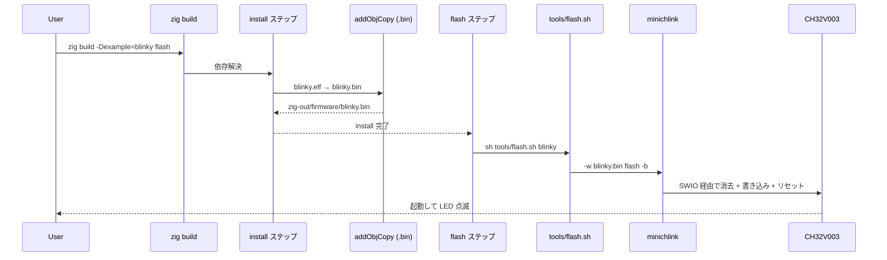

# Chapter 09: minichlink で実機に書き込む

## 学習目標

- CH32V003 のデバッグ / 書き込みインタフェース **SWIO** の位置付けを知る
- `minichlink` がどんなツールなのか、 なぜ ch32fun 側のリポジトリから持ってきているのかを理解する
- 本プロジェクトの `tools/flash.sh` が何をしているかを 1 行ずつ読める
- `zig build … flash` が走ったときの呼び出し連鎖を辿れる

---

## CH32V003 への書き込みインタフェース

CH32V003 のデバッグ・プログラミングは、 **SWIO (1-wire シリアル)** で行う。 ARM Cortex-M で言う SWD に似た「データ 1 本 + GND だけで全部できる」系のインタフェースだ。

```
                    +---------+
   PC  ──USB──▶  WCH-LinkE   ──SWIO(1線)──▶  CH32V003
                    +---------+
                       GND ──────────────▶  GND
```

PC 側のホストアダプタは **WCH-LinkE** (公式のドングル) や、 「他の CH32V を WCH-LinkE 互換のプログラマに仕立てた」自作プログラマなどを使う。 SWIO の物理プロトコルは公開されていて、 PC ⇄ ホストアダプタ間は USB ベンダ独自プロトコルでつながる。

---

## minichlink とは

[`cnlohr/ch32fun`](https://github.com/cnlohr/ch32fun) リポジトリの `minichlink/` に同梱されている、 **WCH-LinkE 互換アダプタを叩く小さな CLI ツール** 。

- C で書かれている
- 依存は `libusb-1.0` だけ
- macOS / Linux / Windows でビルド可能
- 動作モード: 書き込み、 消去、 検証、 リセット、 RAM ロードなど

本プロジェクトでは「`zig build flash` で MCU に焼く」 ために、 既存の minichlink をそのまま使う。 Zig 側から minichlink を呼ぶ薄いシェルスクリプトを置くだけで、 全部の経路が成立する。

---

## minichlink のビルド

依存:

- `gcc` / `clang` などの C コンパイラ
- `make`
- `libusb-1.0` (Mac は `brew install libusb`、 Debian/Ubuntu は `libusb-1.0-0-dev`)
- `pkg-config`

セットアップ:

```sh
cd ..
git clone https://github.com/cnlohr/ch32fun.git
make -C ch32fun/minichlink
```

成功すると `ch32fun/minichlink/minichlink` という実行ファイルが生まれる。 これが本プロジェクトのデフォルトの参照先だ。

---

## `tools/flash.sh` を読む

```sh
#!/usr/bin/env sh
set -eu

if [ "$#" -ne 1 ]; then
  echo "usage: tools/flash.sh <example>" >&2
  exit 2
fi

EXAMPLE="$1"
BIN="zig-out/firmware/${EXAMPLE}.bin"
MINICHLINK="../ch32fun/minichlink/minichlink"

if [ ! -x "$MINICHLINK" ]; then
  echo "minichlink not found: $MINICHLINK" >&2
  echo "Build it first: make -C ../ch32fun/minichlink" >&2
  exit 1
fi

if [ ! -f "$BIN" ]; then
  echo "missing binary: $BIN" >&2
  echo "run: zig build -Dexample=$EXAMPLE" >&2
  exit 1
fi

exec "$MINICHLINK" -w "$BIN" flash -b
```

順番に意味を取ると:

| 行 | 意味 |
|---|---|
| `set -eu` | 失敗したら即座に終了、未定義変数で死ぬ。シェルスクリプトの安全策。 |
| 引数チェック | サンプル名 1 つを必須にし、誤用を早期に止める |
| `MINICHLINK=../ch32fun/minichlink/minichlink` | 「`ch32fun_zig` と `ch32fun` を兄弟ディレクトリに置く」前提でパスを固定 |
| 存在チェック × 2 | minichlink バイナリと `.bin` がそれぞれ無ければ親切なメッセージを出して終了 |
| `exec minichlink -w "$BIN" flash -b` | 自分自身を minichlink で置き換えて呼び出す |

最後の `minichlink` のオプションは:

- `-w <file>` — 書き込み対象ファイル
- `flash` — 書き込み先 (FLASH)
- `-b` — 書き込み後にリセットを発行し、 動かす

これで「焼いたあとすぐ動き出す」までが 1 コマンドで完結する。

---

## `zig build flash` の呼び出し連鎖

第 7 章のステップグラフでも触れたが、 流れを再掲しておく。



---

## トラブルシューティングの勘所

CH32V003 への書き込みは、 周辺の小さなトラブルでつまずきがち。 代表的なものを挙げておく。

### 1. `minichlink` がデバイスを見つけない

- USB の権限。 Linux なら `udev` ルールが必要。 ch32fun リポジトリの `minichlink/49-wch.rules` を `/etc/udev/rules.d/` に入れて `udevadm control --reload-rules` し、 ユーザを `plugdev` に追加。
- Mac は通常そのまま使える。 ただし他のアプリ (例: ベンダ純正の WCH-LinkUtility) が同じ USB をつかみっぱなしだと衝突する。

### 2. `minichlink` を見つけられない (zig build flash 時)

- `tools/flash.sh` は `../ch32fun/minichlink/minichlink` を固定パスで見る。 別の場所に置く場合はスクリプトを書き換えるか、 シンボリックリンクで対応するのが楽。

### 3. 書き込みは成功するが LED が点滅しない

- 第 5 章の起動シーケンスを疑う。 特に `mtvec` 設定 / `.bss` クリア / `.data` コピーのいずれかが噛み合っていないと、 ELF は焼けるけど挙動が変、 になる。
- まずは `zig build disasm` で `.lst` を見て、 `_start` が `0x0800_xxxx` のどこに居て、 `.vector_table` の最初のエントリがそれを指しているかを目視確認するのがおすすめ。

### 4. `RDPR` (リードプロテクション) で書き込み拒否

- 既に他のファームが入っていてプロテクションが効いている個体に当たることがある。 `minichlink` には解除コマンドもあるので、 ch32fun の README を参照のこと。

---

## まとめ

- 書き込みは WCH-LinkE 互換アダプタ + minichlink で行う、 SWIO ベースのワイヤ 1 本構成
- `tools/flash.sh` は **「minichlink を `../ch32fun/minichlink/minichlink` で探して、`.bin` を焼く」だけの薄いラッパ** で、 これによって Zig 側のビルドシステムから minichlink を呼べる
- `zig build flash` は `install` を必ず先行させるよう依存が貼ってあるので、 ビルドし忘れて古い `.bin` を焼く事故は起きにくい

ここまでで「コード → ELF → `.bin` → MCU の FLASH」までの一直線の道筋が完全に揃ったことになる。 次章からは視点を変えて、 **`main` から HAL を呼ぶ側** のしくみ — つまりレジスタ抽象化と HAL の設計について見ていく。
