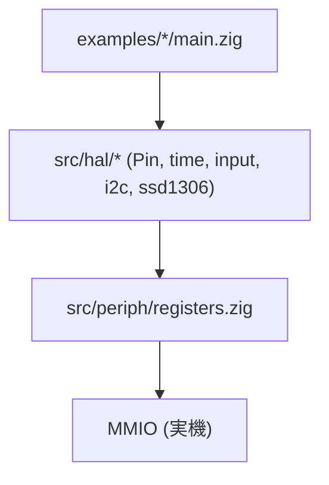

# Chapter 11: HAL — GPIO と SysTick

## 学習目標

- `src/hal/gpio.zig` の `Pin` 型がどんな API を提供しているか把握する
- `src/hal/time.zig` の `delayMs` / `systick.init` がどう SysTick を使っているか読み解ける
- `src/hal/input.zig` のような薄いラッパが「GPIO の使い方の例」を兼ねていることを理解する
- レジスタ層 (第 10 章) からアプリ層への抽象化の階段がどう積まれているかを掴む

---

## HAL の位置付け

第 10 章で見たレジスタ層は「データシートのオフセット表を Zig 型に写経した」もので、 触り心地は半分ハードに近い。 そこにアプリが直接触ると、 - ビットマスク手書き、 - クロック有効化忘れ、 - レジスタオフセット計算ミス、 が必ず起きる。

HAL レイヤは、 これらを「ポート / ピン / モード」のような **MCU 寄りのドメインモデル** に持ち上げる役目を持つ。 ただし汎用ライブラリではないので、 「GPIO ピンを 1 本動かす」「SysTick で時間を測る」 のような最小限の道具立てに絞っている。



---

## `src/hal/gpio.zig` を読む

### `Port` / `Mode` 列挙

```zig
pub const Port = enum {
    A,
    C,
    D,
};

pub const Mode = enum(u4) {
    input_analog = 0,
    input_floating = 4,
    input_pull = 8,
    output_pp_10mhz = 1,
    output_pp_2mhz = 2,
    output_pp_30mhz = 3,
    output_od_10mhz = 5,
    output_od_2mhz = 6,
    output_od_30mhz = 7,
    output_af_pp_10mhz = 9,
    output_af_pp_2mhz = 10,
    output_af_pp_30mhz = 11,
    output_af_od_10mhz = 13,
    output_af_od_2mhz = 14,
    output_af_od_30mhz = 15,
};
```

CH32V003 の GPIO は、 `CFGLR` レジスタの **4 ビット = 1 ピン** で「方向 + 速度 + プルアップ/オープンドレイン」を一括指定する設計。 `Mode` の値は、 そのまま `CFGLR` に流す 4-bit パターンになっている。

そして `Mode` を **`enum(u4)`** にしたのが効いていて、 `@intFromEnum(mode)` でそのまま 4-bit 値として扱える。 値の妥当性 (0〜15 の範囲) は型レベルで保証される。

### `Pin` 型

```zig
pub const Pin = struct {
    port: Port,
    index: u4,

    pub fn configure(self: Pin, mode: Mode) void {
        const g = self.gpio();
        const shift: u5 = @as(u5, self.index) * 4;
        const mask: u32 = @as(u32, 0xF) << shift;
        const value: u32 = @as(u32, @intFromEnum(mode)) << shift;

        g.CFGLR = (g.CFGLR & ~mask) | value;
    }

    pub fn write(self: Pin, value: bool) void {
        const g = self.gpio();
        const bit: u32 = @as(u32, 1) << self.index;
        if (value) {
            g.BSHR = bit;
        } else {
            g.BSHR = bit << 16;
        }
    }

    pub fn toggle(self: Pin) void {
        self.write(!self.readOut());
    }

    pub fn read(self: Pin) bool {
        const g = self.gpio();
        return ((g.INDR >> self.index) & 0x1) != 0;
    }

    pub fn readOut(self: Pin) bool {
        const g = self.gpio();
        return ((g.OUTDR >> self.index) & 0x1) != 0;
    }

    fn gpio(self: Pin) *volatile regs.GpioRegs {
        return switch (self.port) {
            .A => regs.gpioA(),
            .C => regs.gpioC(),
            .D => regs.gpioD(),
        };
    }
};

pub fn pin(comptime port: Port, comptime n: u4) Pin {
    return .{ .port = port, .index = n };
}
```

注目したい設計が 3 点ある。

#### 1. `Pin` は値型で軽い

`Pin` は `Port` (列挙) と `index: u4` のペアだけ。 関数の引数として渡しても、 ほぼレジスタ 1 本分のデータしか動かない。 結果として、 `led.toggle()` のような呼び出しはインライン化されて生のレジスタ操作と遜色ない出力になる。

#### 2. `configure` — リード・モディファイ・ライト

```zig
const mask: u32 = @as(u32, 0xF) << shift;
g.CFGLR = (g.CFGLR & ~mask) | value;
```

`CFGLR` は他のピンの設定も同居しているので、 該当 4 ビットだけを差し替える RMW を行う必要がある。 これを「ピンを設定する」 1 メソッドに閉じ込めたのが API としての価値。

#### 3. `write` — `BSHR` で 1 ライトのアトミック化

```zig
if (value) {
    g.BSHR = bit;
} else {
    g.BSHR = bit << 16;
}
```

`BSHR` (Bit Set/Reset) は **「下位 16 ビットを 1 にすると対応ピンが H、 上位 16 ビットを 1 にすると L」** という仕様。 つまり「他のピンに副作用を出さず、 1 ライトでビットを立てる/落とす」 ことができる。 OUTDR を RMW すると、 タイミング次第で割り込みハンドラと競合し得る (片方が古い値を書き戻す) ので、 こちらの方が安全。

### `enablePortClock` / `enableAllClocks`

```zig
pub fn enablePortClock(port: Port) void {
    const rcc = regs.rcc();
    switch (port) {
        .A => rcc.APB2PCENR |= regs.RCC_APB2_GPIOA,
        .C => rcc.APB2PCENR |= regs.RCC_APB2_GPIOC,
        .D => rcc.APB2PCENR |= regs.RCC_APB2_GPIOD,
    }
}

pub fn enableAllClocks() void {
    const rcc = regs.rcc();
    rcc.APB2PCENR |= regs.RCC_APB2_AFIO | regs.RCC_APB2_GPIOA | regs.RCC_APB2_GPIOC | regs.RCC_APB2_GPIOD;
}
```

CH32V003 では「使う前にクロックを供給」が必須で、 そこをサボると **レジスタ書き込みが効かない (= 静かに失敗する)** という最悪のバグになる。 HAL 側で「ポート単位で有効化」 / 「全 GPIO + AFIO 一括」 を関数化してある。

`blinky` の例:

```zig
fun.system.init(.{});
fun.gpio.enableAllClocks();        // ← これを忘れると LED が点かない
const led = fun.gpio.pin(.D, 0);
led.configure(.output_pp_10mhz);
```

---

## `src/hal/time.zig` を読む

### `delayMs` — シンプルなビジーウェイト

```zig
pub fn delayMs(ms: u32) void {
    const ticks_per_ms = system.core_clock_hz / 1000;
    const wait_ticks = ms * ticks_per_ms;
    const start = regs.systick().CNT;

    while (@as(u32, regs.systick().CNT -% start) < wait_ticks) {}
}
```

- **`-%`** は Zig のラップアラウンド付き減算。 SysTick の `CNT` は 32-bit で自由走行しており、 オーバーフローしうるので、ラップを許す減算で経過 tick を計算する。
- **`system.core_clock_hz / 1000`** — クロックが 48MHz なら 48000 tick = 1 ms。 `system.init` でクロックを設定したあとに呼ぶ前提。
- 何も寝かさない単純なビジーループ。 省電力にはほぼ寄与しないが、 タイミングのジッタは最小。

### `systick.init` — 周期割り込み有効化

```zig
pub const systick = struct {
    pub fn init(tick_hz: u32) void {
        const st = regs.systick();

        systick_ticks_per_irq = system.core_clock_hz / tick_hz;
        if (systick_ticks_per_irq == 0) {
            systick_ticks_per_irq = 1;
        }

        st.CTLR = 0;
        st.CMP = systick_ticks_per_irq - 1;
        st.CNT = 0;
        st.SR = 0;
        systick_ticks = 0;

        // Keep SysTick running from HCLK without ISR binding in this stage.
        st.CTLR = regs.SYSTICK_CTLR_STE | regs.SYSTICK_CTLR_STCLK;
    }

    pub fn nowTicks() u64 {
        const st = regs.systick();
        if (systick_ticks_per_irq == 0) return 0;
        return st.CNT / systick_ticks_per_irq;
    }

    pub fn onTick(handler: *const fn () callconv(.c) void) void {
        tick_handler = handler;
    }
};
```

- `tick_hz` を引数に取り、 「1 tick あたり何 SysTick カウントか」を計算 (`systick_ticks_per_irq`)
- CTLR を一旦 0 にしてから設定し直すことで、 二重起動時の不整合を防ぐ
- `onTick(handler)` で **ユーザ定義コールバック** を登録できる。 中身は第 6 章で見た `_systick_irq_body` から呼ばれる

`timer_irq` サンプルではこのコールバックを設定し、 「定期的に LED フラグを反転 → メインループから書き出し」 という SysTick 周期処理のパターンを実装している。

### `systickInterruptBody`

```zig
pub fn systickInterruptBody() callconv(.c) void {
    const st = regs.systick();

    st.CMP +%= systick_ticks_per_irq;
    st.SR = 0;
    systick_ticks +%= 1;

    if (tick_handler) |handler| {
        handler();
    }
}
```

- `CMP` を「次の発火点」に進める。 `+%=` はラップアラウンド加算。
- `SR` を 0 にして割り込みフラグを下ろす。
- グローバルカウンタをインクリメント。
- 登録があれば handler を呼ぶ。

ハンドラ本体を `_systick_irq_body` から呼ぶことで、 アセンブリの「全レジスタ退避部」と「実際の処理」を分離している (第 6 章参照)。

---

## `src/hal/input.zig` — HAL の最小ラッパの例

```zig
pub fn initButtonPd1Pullup() void {
    gpio.enablePortClock(.D);

    const button = gpio.pin(.D, 1);
    button.configure(.input_pull);
    button.write(true);
}

pub fn isButtonPressed() bool {
    return !gpio.pin(.D, 1).read();
}
```

- `PD1` を入力 + プルアップに設定し、 `BSHR` 経由で `OUTDR` のビットを立てて **内部プルアップを有効化**する (CH32V003 の入力プルアップは OUTDR のビットで決まる)
- ボタンは「押すと GND に落ちる」アクティブ Low 配線を想定。 `read()` の `false` = 押下、 なので返却時に反転している

`oled` サンプルがそのまま呼んでいる:

```zig
fun.input.initButtonPd1Pullup();
...
const pressed = fun.input.isButtonPressed();
if (pressed and !prev_button) {
    fast_mode = !fast_mode;
}
prev_button = pressed;
```

「ピン番号と配線がアプリ側のドメイン知識として漏れない」 ようにする、 という HAL の本来の目的の小さな例だ。

---

## まとめ

- `Pin` 型は値型として軽く、 `configure` / `write` / `toggle` / `read` で MCU のレジスタ操作を集約
- `write` は副作用回避のため `BSHR` の 1 ライトを使う
- `delayMs` は SysTick の自由走行カウンタとラップアラウンド減算で実装
- `systick.init` + `onTick` で周期割り込みハンドラを差し込める設計
- `input.zig` は「HAL の使い方の例」を兼ねた最薄ラッパで、 アプリ側にピン番号が漏れない

次章では、 I2C と SSD1306 — 「複数バイト通信を行う周辺ドライバ」 を読んでいく。 GPIO よりも状態機械が深く、 タイムアウト処理も必要になる、 もうひとつ大きな抽象化レイヤだ。
