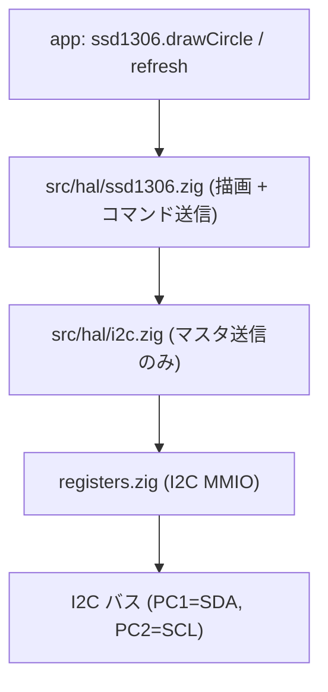

# Chapter 12: HAL — I2C と SSD1306

## 学習目標

- 本プロジェクトの I2C ドライバが「マスタ送信のみのブロッキング実装」であることを把握する
- I2C のイベントフラグ (`STAR1`/`STAR2`) を組み合わせてステートを判定する作法を読む
- SSD1306 ドライバが **128×64 のフレームバッファを 1024 バイトの RAM** に持ち、 32 バイト単位で送信する設計の理由を理解する
- フレームバッファ → I2C 経路の各ステップで RAM/ROM/CPU 時間がどう使われているかを掴む

---

## なぜ I2C と SSD1306 を一緒に扱うか

`src/hal/i2c.zig` と `src/hal/ssd1306.zig` は、 アプリ視点では別物だが、 「下層 = I2C のブロッキング送信」 / 「上層 = ピクセル描画 + パネル送信」 の縦の関係になっている。 SSD1306 のドライバが大きいのは、 ほとんどが「描画系の操作」で、 I2C 越しの操作はほんの一部 (init + refresh) に過ぎない。



---

## `src/hal/i2c.zig` を読む

### 設計方針

- **マスタ送信のみ**。 受信や複数マスタ対応は意図的に省略。 SSD1306 は単方向だけで使えるため、 これでスコープが収まる。
- **全部ブロッキング**。 割り込みを使わない。 タイムアウトは「規定回数のループ」というスピンカウンタで実装。
- **`Error` 列挙で何でこけたか分かる**。

```zig
pub const Error = error{
    BusyTimeout,
    MasterModeTimeout,
    TxModeTimeout,
    TxEmptyTimeout,
    TxDoneTimeout,
};
```

### 初期化

```zig
pub fn initI2c1FastMode() void {
    const rcc = regs.rcc();

    rcc.APB2PCENR |= regs.RCC_APB2_GPIOC;
    rcc.APB1PCENR |= regs.RCC_APB1_I2C1;

    gpio.pin(.C, 1).configure(.output_af_od_10mhz); // SDA
    gpio.pin(.C, 2).configure(.output_af_od_10mhz); // SCL

    resetAndSetup();
}
```

- GPIOC と I2C1 のクロックを供給
- `PC1` / `PC2` を **オープンドレインの代替機能** (= I2C のフィジカル割り当て) に設定
- `resetAndSetup()` で I2C1 を初期化

`resetAndSetup` は CTLR1 / CTLR2 / CKCFGR を順に設定し、 最終的に PE (ペリフェラル有効) と ACK を立てる典型的な手順。 周波数は **1MHz Fast mode** で動かす。

```zig
const bus_clock_hz: u32 = 1_000_000;
const logic_clock_hz: u32 = 2_000_000;
```

- `bus_clock_hz` — SCL の周波数
- `logic_clock_hz` — I2C ペリフェラル内部のロジッククロック (`CTLR2.FREQ` に書く値の元)

### イベントフラグの組み合わせ

```zig
const evt_master_mode_select: u32 = 0x00030001;
const evt_master_tx_selected: u32 = 0x00070082;
const evt_master_byte_transmitted: u32 = 0x00070084;

fn checkEvent(mask: u32) bool {
    const i2c = regs.i2c1();
    const status: u32 = @as(u32, i2c.STAR1) | (@as(u32, i2c.STAR2) << 16);
    return (status & mask) == mask;
}
```

CH32V / STM32 系の I2C はベンダドキュメントで「イベント」と呼ばれる **複数フラグの組合せ** で状態を判定する。 上位 16-bit に `STAR2`、 下位 16-bit に `STAR1` を積んで 1 つの 32-bit 比較に持ち込む書き方は、 多くのベンダ純正コードでも見られる典型イディオム。

### ブロッキング送信

```zig
pub fn writeBlocking7bit(addr: u7, bytes: []const u8) Error!void {
    const i2c = regs.i2c1();

    var timeout: i32 = timeout_max;
    while ((i2c.STAR2 & regs.I2C_STAR2_BUSY) != 0 and timeout > 0) : (timeout -= 1) {}
    if (timeout <= 0) return Error.BusyTimeout;

    i2c.CTLR1 |= regs.I2C_CTLR1_START;

    timeout = timeout_max;
    while (!checkEvent(evt_master_mode_select) and timeout > 0) : (timeout -= 1) {}
    if (timeout <= 0) return Error.MasterModeTimeout;

    i2c.DATAR = @as(u16, addr) << 1;

    timeout = timeout_max;
    while (!checkEvent(evt_master_tx_selected) and timeout > 0) : (timeout -= 1) {}
    if (timeout <= 0) return Error.TxModeTimeout;

    for (bytes) |b| {
        timeout = timeout_max;
        while ((i2c.STAR1 & regs.I2C_STAR1_TXE) == 0 and timeout > 0) : (timeout -= 1) {}
        if (timeout <= 0) return Error.TxEmptyTimeout;

        i2c.DATAR = b;
    }

    timeout = timeout_max;
    while (!checkEvent(evt_master_byte_transmitted) and timeout > 0) : (timeout -= 1) {}
    if (timeout <= 0) return Error.TxDoneTimeout;

    i2c.CTLR1 |= regs.I2C_CTLR1_STOP;
}
```

順番が完全に「I2C のシーケンス図そのもの」になっている。

1. バスの BUSY が下りるのを待つ
2. START を発行
3. マスタモードになるのを待つ (`evt_master_mode_select`)
4. アドレス + W を送る (`addr << 1`)
5. 「送信器として選ばれた」状態 (`evt_master_tx_selected`) を待つ
6. 送りたいバイトをすべて DATAR に書く (TXE フラグを確認しながら)
7. 最後の 1 バイトが送信完了 (`evt_master_byte_transmitted`) するのを待つ
8. STOP を発行

各ループで `timeout` をデクリメントして「ハングしない安全網」を入れている。 ハードの何かがおかしいとき (たとえばプルアップが付いてなくて SCL が H に戻らない)、 `BusyTimeout` で抜けてアプリにエラーを返せるので、 後追いデバッグがやりやすい。

---

## `src/hal/ssd1306.zig` を読む

### フレームバッファのデザイン

```zig
pub const width: u8 = 128;
pub const height: u8 = 64;
pub var buffer: [width_us * height_us / 8]u8 = [_]u8{0} ** (width_us * height_us / 8);
```

- 128 × 64 = 8192 pixel。 1 ピクセル 1 bit なので `8192 / 8 = 1024` バイト。
- SRAM は 2KB しか無く、その **半分をフレームバッファが占有する**。 シングルバッファだけ持つのはこの制約のため。
- 「縦 8 ピクセルが 1 バイト = 縦方向ストライプ」というレイアウト。 SSD1306 のページモード GDDRAM 配置 (YYYxxxxx) にそのまま合うので、 シリアル送信時に変換しなくて良い。

### ピクセル描画

```zig
pub fn drawPixel(x: i16, y: i16, color: bool) void {
    if (x < 0 or y < 0) return;
    if (x >= width or y >= height) return;

    const xu: usize = @intCast(x);
    const yu: usize = @intCast(y);
    const addr = xu + @as(usize, width) * (yu / 8);
    const mask: u8 = @as(u8, 1) << @as(u3, @intCast(yu & 7));

    if (color) {
        buffer[addr] |= mask;
    } else {
        buffer[addr] &= ~mask;
    }
}
```

- `addr = x + 128 * (y / 8)` — ページ単位の縦ストライプにマップ
- `mask = 1 << (y % 8)` — ページ内のビット位置
- `i16` で受けてレンジ外を早めに弾く。 描画コードを書くアプリ側は座標が負になりがちなので、 ここでの境界チェックがあると上位コードがシンプルに保てる

### コマンドとデータの送信

```zig
fn cmd(command: u8) Error!void {
    var pkt = [_]u8{ 0x00, command };
    try i2c.writeBlocking7bit(i2c_addr, pkt[0..]);
}

fn data(chunk: []const u8) Error!void {
    var pkt: [packet_size + 1]u8 = undefined;
    pkt[0] = 0x40;
    @memcpy(pkt[1 .. 1 + chunk.len], chunk);
    try i2c.writeBlocking7bit(i2c_addr, pkt[0 .. 1 + chunk.len]);
}
```

- SSD1306 の **Co/D/C** プロトコルそのまま。 先頭バイトが `0x00` ならコマンド、 `0x40` ならデータ。
- データは **`packet_size = 32`** バイト単位で送る。 SSD1306 自体は任意長を受けられるが、 切れ目を入れることでスタックやループ実装が単純になる。

### 画面更新

```zig
pub fn refresh() !void {
    try cmd(0x21);
    try cmd(0);
    try cmd(width - 1);

    try cmd(0x22);
    try cmd(0);
    try cmd(7);

    var i: usize = 0;
    while (i < buffer.len) : (i += packet_size) {
        const end = @min(i + packet_size, buffer.len);
        try data(buffer[i..end]);
    }
}
```

- `0x21` 系コマンドで「列アドレス範囲 = 0〜127」「ページアドレス範囲 = 0〜7」を設定し、 続けて GDDRAM への書き込みモードに入る
- 1024 バイトのフレームバッファを 32 バイトずつ送信。 ループ回数は 32 回固定

このループの所要時間が、 描画 → 表示までの体感レイテンシそのものなので、 I2C 速度を上げる (今回は 1MHz Fast mode) と気持ちよく動く。

### 上位 API の役割分担

- 描画系 (`drawPixel` / `drawLine` / `drawCircle` / `drawRoundRect` / ...) は **フレームバッファだけ** を触る
- バス側を叩くのは `initI2c` / `initPanel` / `refresh` の 3 つだけ
- アプリは描画関数で構図を組み立て、 最後に 1 回 `refresh()` する、 という「ダブルバッファ的」な書き口になる

このおかげで、 描画コードは I2C のタイムアウトや状態遷移を意識せずに済む。 第 11 章で見た GPIO HAL より一段ドメインに近い API、 という位置付け。

### 回転とビットマップ

`drawStrRot` / `drawCharRot` / `drawImageRot` は `Rotation = .deg0/.deg90/.deg180/.deg270` を受け取り、 回転後の座標を `rotatePoint` 関数で計算してから `blendPixel` を呼ぶ。 中間バッファを持たない (= 1024 バイト以外の絵用 RAM を使わない) のは 2KB しかない SRAM への配慮で、 計算量が多い代わりにメモリは喰わない、というトレードオフを選んでいる。

```zig
fn rotatePoint(sx: i16, sy: i16, w: i16, h: i16, rotation: Rotation) struct { x: i16, y: i16 } {
    return switch (rotation) {
        .deg0 => .{ .x = sx, .y = sy },
        .deg90 => .{ .x = h - 1 - sy, .y = sx },
        .deg180 => .{ .x = w - 1 - sx, .y = h - 1 - sy },
        .deg270 => .{ .x = sy, .y = w - 1 - sx },
    };
}
```

回転変換を一箇所に閉じ込めて、 上位のループは「(sx, sy) について dest を求めて、 そこに `blendPixel`」 という統一形で書けるようにしてある。

---

## 全体を貫くデザイン原則

第 10 章のレジスタ層 → 第 11 章の GPIO/SysTick HAL → 第 12 章の I2C/SSD1306 HAL と段を上がってきて、 設計指針はぶれていない:

1. **下層は MCU の語彙のままに薄く写経**。 命名は基本的にデータシート通り。
2. **上層はアプリ側のドメインに寄せる**。 ただし汎用化はしない。 「このプロジェクトの用途」で必要な分だけ作る。
3. **割り込みやイベント駆動は最小限**。 タイミングが厳しくない箇所はビジーループ + タイムアウトでよしとする。
4. **RAM は神聖**。 2KB しかないので、 描画バッファ 1 枚で全部こなす。 中間バッファは持たない。
5. **エラーは Zig の `!T` で素直に上げる**。 SSD1306 側の `Error` は I2C の `Error` をそのまま採用 (`pub const Error = i2c.Error;`)。

これらを通して読むと、 「組み込みの薄い HAL を Zig で書くなら、 だいたいこの粒度に落ち着くだろう」 という素朴な良いリファレンスになっている。

---

## まとめ

- I2C はマスタ送信のみのブロッキング実装。 タイムアウト付きスピンウェイトで安全に止まれる
- SSD1306 ドライバは 1024 バイトのシングルフレームバッファ + 32 バイト単位送信
- 描画 API はフレームバッファのみを操作し、 バスは `refresh()` 1 箇所に集約
- 回転処理はピクセル単位で計算し、 中間バッファを持たない方針で 2KB SRAM に収まるようにしてある

---

## 本書の結び

ここまでで、 ch32fun_zig が「Zig 一本で CH32V003 (RV32EC) のファームウェアを生成・書き込み」 までやり切るための **全ての段** を歩いてきた。

- **ターゲット指定**: `Target.Query` で RV32EC を組む (第 2 章)
- **クロスコンパイル基盤**: LLVM + lld + compiler_rt が Zig に同梱 (第 3 章)
- **配置**: リンカスクリプトで FLASH/RAM を割り当て (第 4 章)
- **起動**: `_start` から `main()` までの整地作業 (第 5 章)
- **割り込み**: ベクタテーブルと SysTick (第 6 章)
- **ビルドパイプライン**: `build.zig` のステップグラフ (第 7 章)
- **書き込み用フォーマット**: ELF → `.bin` / `.hex` (第 8 章)
- **書き込み**: minichlink + SWIO (第 9 章)
- **MMIO 抽象化**: `extern struct` と `*volatile T` (第 10 章)
- **GPIO/SysTick HAL**: アプリ寄りの薄いラッパ (第 11 章)
- **I2C/SSD1306 HAL**: I/O + 描画の縦の積み重ね (第 12 章)

それぞれの章は独立に読んでも価値があるが、 通して読むと **「組み込み RISC-V を Zig で扱う時、 各層がどれだけ薄くたためるか」** の一つの実装例として鑑賞できる構成になっている。 自分のターゲット MCU が CH32V003 でなくとも、 RV32IM 系の MCU や Cortex-M に Zig を持ち込みたい場合の道標になれば幸いだ。
