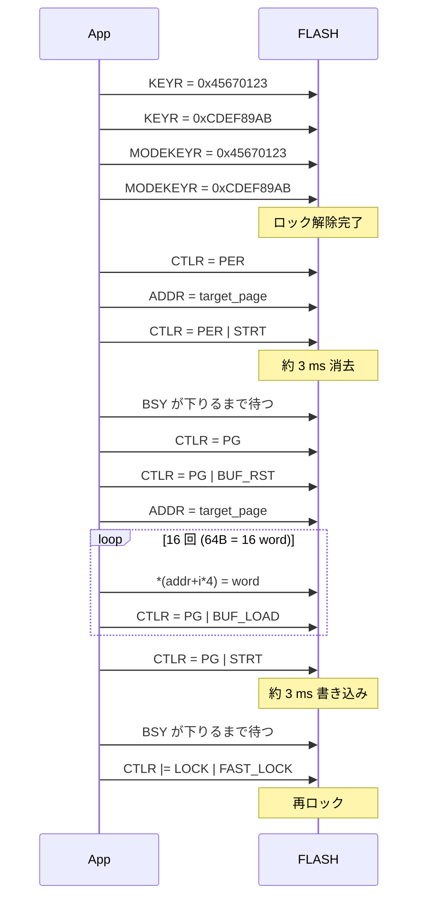

# Chapter 14: データの永続化 — 内蔵 FLASH に書く HAL

## 学習目標

- CH32V003 にはなぜ EEPROM が無く、 永続化はどう実現するのかを知る
- 本プロジェクトの `src/hal/flash.zig` が提供する API を読んで、 アプリから使えるようになる
- 「ページ消去 → ページプログラム」 のシーケンスをハード視点で説明できる
- リンカで「ユーザデータ用ページ」を予約する仕組みを理解する
- 寿命 (≒10,000 回) と単位 (64B/ページ) を意識した使い方ができる

---

## CH32V003 の永続化事情

CH32V003 には専用の EEPROM が **無い**。 永続化したいなら、 ファームウェアが入っているのと同じ 16KB の **内蔵 FLASH** に自分で書き込む。

| 観点 | 内容 |
|---|---|
| 単位 | **64 バイト = 1 ページ**。 これより小さい粒度では消せない / 書けない |
| 書き換え寿命 | **約 10,000 サイクル**/ページ (TRM の典型値) |
| 1 ページ消去にかかる時間 | 約 **3 ms** (busy ループで待つ) |
| 1 ページ書き込みにかかる時間 | 約 **3 ms** |
| 書ける方向 | 「`1` のビットを `0` にする」のみ。 逆方向はページ消去で全ビット `1` に戻す |
| アクセス方法 | 読みは通常のメモリロード命令で OK。 書きは `FLASH` 周辺レジスタを通して unlock + erase + program |
| 同じ FLASH をコードも使っている | **ユーザデータ用に領域を分けないと .text が侵食して使えなくなる** |

「EEPROM ライク」 な使い方をしたければ、 FLASH の最後のページなどを「ユーザデータ用」として確保し、 そこだけ書き換える形にする。 本プロジェクトはまさにそれをやっている。

---

## 設計判断

本プロジェクトの永続化 HAL は次の方針で設計してある:

1. **物理アドレス指定の低レベル API** (`erasePage` / `programPage` / `writePage`) を素直に公開する
2. その上に **薄い KV 風ラッパ `Slot(T)`** を提供して、 アプリは「1 構造体 = 1 ページ」 のシンプルなモデルだけで永続化できるようにする
3. **リンカスクリプトでユーザデータページ (64B) を予約**して、 アプリのコードが誤って侵食したらリンクエラーで気付けるようにする

これにより、 「ハードを直接叩きたい」用途と「ミニゲームのスコアを保存したい」用途が、 同じモジュールから別レベルでアクセスできる。

---

## リンカスクリプトでの予約

`src/runtime/linker.ld` を 2 つの FLASH 領域に分けてある:

```ld
MEMORY
{
    FLASH     (rx)  : ORIGIN = 0x08000000, LENGTH = 16K - 64
    USER_DATA (r)   : ORIGIN = 0x08003FC0, LENGTH = 64
    RAM       (rwx) : ORIGIN = 0x20000000, LENGTH = 2K
}
```

- `FLASH` : コード + `.rodata` + `.data` の LMA 用、 16KB - 64B
- `USER_DATA` : 永続データ用、 64B = 1 ページ

`.text` / `.rodata` が `FLASH` を超えた場合、 リンカが「USER_DATA を覆ってしまう」 とは見なさず単純に **`region 'FLASH' overflowed`** で落ちる。 つまり「アプリが太ってきても、 ユーザデータ領域が静かに浸食される事故は起きない」 という安全側のレイアウトになっている。

リンカは USER_DATA の物理アドレスをシンボルとして HAL に渡す:

```ld
PROVIDE(_user_data_start = ORIGIN(USER_DATA));
PROVIDE(_user_data_size  = LENGTH(USER_DATA));
```

`src/hal/flash.zig` の `userDataAddr()` がこれを参照している:

```zig
extern var _user_data_start: u8;

pub fn userDataAddr() usize {
    return @intFromPtr(&_user_data_start);
}
```

第 5 章の `extern var _sbss: u32` と同じイディオムで、 「リンカが用意したシンボルのアドレスだけが欲しい」 ケースだ。

---

## ハード視点の手順 — Fast Program モード

CH32V003 の FLASH は「Fast Page Erase」 「Fast Page Program」 という 64B 単位の操作を持つ。 操作シーケンスは TRM (Technical Reference Manual) に従って:



要点:

- **2 段ロック**: `KEYR` (主ロック) と `MODEKEYR` (fast モード) の両方を `0x45670123 → 0xCDEF89AB` の順で解除する
- **消去とプログラムは別フェーズ**: erase は `PER` ビット、 program は `PG` ビット (TRM では FTPG/FTER とも呼ばれる)
- **ページバッファ**: program 時はまず CPU が普通のメモリ書き込み命令で 4 バイトずつ書き、 直後に `BUF_LOAD` を立てて「FLASH 側の内部バッファに 1 ワード積んだよ」と教える。 64B 分積んだあと `STRT` で実 FLASH に焼き込む
- **STATR の BSY ビット**: 操作中は立ちっぱなしになるので、 完了まで spin する
- **書き込み後は必ず再ロック**: 何かの暴走で意図しないアドレスを書き換えないため

---

## HAL の API

`src/hal/flash.zig` を `@import("ch32fun").flash` 経由で使う。

### 低レベル API

```zig
pub const page_size: usize = 64;
pub const Page = [page_size]u8;

pub fn unlock() Error!void;
pub fn lock() void;
pub fn erasePage(addr: usize) Error!void;
pub fn programPage(addr: usize, src: *const Page) Error!void;
pub fn writePage(addr: usize, src: *const Page) Error!void;
pub fn readPage(addr: usize, dst: *Page) Error!void;
pub fn userDataAddr() usize;
```

`writePage` は erase + program + verify を 1 関数にしたコンビニエンス。 通常はこれで足りる。

エラー型:

```zig
pub const Error = error{
    UnlockFailed,    // KEYR シーケンスが効かなかった
    BusyTimeout,     // BSY が下りない
    WriteProtected,  // STATR.WRPRTERR が立った
    Misaligned,      // addr % 64 != 0
    OutOfRange,      // addr が FLASH レンジ外
    Verify,          // 書いた後の読み返しが不一致
};
```

### 高レベル API — `Slot(T)`

「1 ページに 1 つの構造体を載せる」 簡易 KV 風ラッパ:

```zig
pub fn Slot(comptime T: type) type;
```

レイアウト:

```
+----------+----------+--------------+--------------------------+
| 2B magic | 2B ver   | 4B reserved  | sizeof(T) バイトの値      |
| 0xCAFE   | u16      |              |                          |
+----------+----------+--------------+--------------------------+
```

- magic でデータの有無を判定 (未書き込みの FLASH は `0xFF` で埋まっている)
- version で「保存形式が変わったらマイグレーション」 ができる

呼び出し:

```zig
const Counter = extern struct {
    boots: u32,
    last_score: u32,
};

const slot = fun.flash.Slot(Counter).default(1); // version = 1

// 読み出し (無ければ null)
const maybe = slot.load();

// 保存
try slot.save(.{ .boots = 7, .last_score = 1024 });

// 「無ければ初期値で保存し、 必ず値を返す」
const c = try slot.loadOrInit(.{ .boots = 0, .last_score = 0 });
```

`Slot` は内部で `unlock()` → `writePage()` → `lock()` を行う。 1 回の `save()` で **1 サイクル消費**される。

### 制約

- `T` のサイズは 56 バイト (= 64 - 8) 以下。 `@compileError` でビルド時に弾く
- `T` は `extern struct` などの **メモリレイアウトが固定された型** にすること (Zig の通常 `struct` だとフィールド並び替えが起きうるので、 別のビルドで読めなくなる可能性あり)

---

## サンプル: `examples/persistent_counter/`

電源 ON のたびに **起動回数を FLASH に保存し、 その回数だけ LED を点滅させる** デモ。

```zig
const fun = @import("ch32fun");

const Counter = extern struct {
    boots: u32,
    last_score: u32,
};

pub fn main() noreturn {
    fun.system.init(.{});
    fun.gpio.enableAllClocks();

    const led = fun.gpio.pin(.D, 0);
    led.configure(.output_pp_10mhz);

    const slot = fun.flash.Slot(Counter).default(1);
    var c = slot.loadOrInit(.{ .boots = 0, .last_score = 0 }) catch Counter{
        .boots = 0, .last_score = 0,
    };
    c.boots +%= 1;
    slot.save(c) catch { /* LED 高速点滅でエラー通知 */ };

    // boots 回ぶん LED を点滅 → ゆっくり点滅ループ
    var n: u32 = 0;
    while (n < c.boots) : (n += 1) {
        led.write(true);  fun.time.delayMs(200);
        led.write(false); fun.time.delayMs(200);
    }
    fun.time.delayMs(1500);
    while (true) {
        led.toggle();
        fun.time.delayMs(1000);
    }
}
```

ビルド & 書き込み:

```sh
zig build -Dexample=persistent_counter flash
```

電源をいったん落として入れ直すたびに、 LED の点滅回数が `1, 2, 3 ...` と増えるはず。 リセットボタンでも同様に増える。

---

## ミニゲームのスコア保存に使うときの設計

「LED を点滅させる」程度の話を、 たとえば SSD1306 (oled サンプル) ベースで作ったミニゲームのハイスコアに置き換えるなら、 こうなる:

```zig
const HighScore = extern struct {
    score: u32,
    last_played_boots: u32,
};

const hs_slot = fun.flash.Slot(HighScore).default(1);

pub fn main() noreturn {
    // 起動時に読み出し
    var hs = hs_slot.loadOrInit(.{ .score = 0, .last_played_boots = 0 }) catch ...;

    while (true) {
        const result = playOneRound(hs);  // ゲーム本体
        if (result.score > hs.score) {
            hs.score = result.score;
            hs_slot.save(hs) catch {
                showError();
            };
        }
    }
}
```

### 設計上の注意

1. **書き込み頻度を絞る** — 寿命 10,000 回は意外と少ない。 1 ゲーム終了ごとに 1 回保存くらいが現実的。 「フレームごとに保存」 は数日でフラッシュを潰す可能性がある
2. **ハイスコアを更新したときだけ書く** — 上の例のように差分があるときだけ save
3. **読み書き時にユーザにフィードバック** — 書き込み中は 3〜6ms 動作が止まる。 OLED 描画中なら一瞬カクつくので、 「セーブ中…」 アイコンを出すと UX が良い
4. **電源断耐性** — `writePage()` の途中で電源が切れると、 そのページは中途半端な状態になる。 magic フィールドが意図せず壊れていれば `load()` は null を返すので、 アプリは「無ければ初期値」 のロジックさえ書いておけば回復はする。 中途半端な「半分書かれた T」 が返ることはない (verify が走り Error.Verify が返る)
5. **複数値を保存するなら 1 つの大きな struct** — `Slot(T)` は 1 ページ = 1 値なので、 「スコア」 と「設定」 を別ページで保存したいなら、 USER_DATA を 64B 単位で増やす (linker.ld で領域を増やす) か、 1 つの struct にまとめる

---

## 寿命を伸ばしたい場合 — Wear Leveling

10,000 サイクル制約はゲーム用途なら大体足りるが、 「秒ごとに保存したい」 ような用途では困る。 そういう時は **ページ内 wear leveling** を実装するのが定石:

```
USER_DATA を 64B のリングバッファとして扱い、
8B ずつ区切って 8 スロット (record 0..7) とする。

各レコード:
  +--- 1B seq番号 (毎回インクリメント) ---+--- 7B データ ---+

書き込み時:
  - 最新の seq を持つレコードの「次のスロット」 に書く
  - 全スロットが 1 ページに収まるので、 ページ消去は 8 回に 1 回で済む

→ 実効寿命が 8 倍に
```

これは本プロジェクトには未実装。 上の構造に従って `Slot` の拡張版を書くと **80,000 サイクル相当** に伸ばせる。 必要に応じてアプリ側で書く立ち位置になる。

---

## 制約と落とし穴 まとめ

| やってはいけないこと | 結果 |
|---|---|
| アライメント無視で `programPage(0x0800_3FC1, ...)` | `Error.Misaligned` |
| FLASH レンジ外 (`0x2000_0000` など) を指定 | `Error.OutOfRange` |
| Unlock を忘れて `programPage` | `Error.UnlockFailed` (or `WriteProtected`) |
| 通常 `struct` (非 extern) を `Slot(T)` に使う | コンパイルは通るがレイアウト保証無し |
| 1 ループで毎回 save | フラッシュ寿命が 100 時間で尽きる |
| `T` のサイズが 57 バイト以上 | `@compileError` でビルド失敗 |

| 推奨 |
|---|
| `T` は `extern struct` で書き、 サイズを 4 アラインに揃える |
| バージョン番号を付けて、 レイアウト変更時に上げる (古いデータは無視される) |
| 「**書き込みに失敗したら LED 高速点滅で通知**」 のような最低限のフィードバックを付ける |
| 開発中はフラッシュサイクルを浪費しないよう、 「保存はリリース時のみ」 など分岐させても良い |

---

## まとめ

- CH32V003 には EEPROM が無く、 永続化は **内蔵 FLASH の末尾 1 ページ** に書く形で実現する
- HAL は **ハード手順を忠実に踏む低レベル関数** と、 **`Slot(T)` という KV 風ラッパ** の 2 層構成
- リンカが `USER_DATA` 領域を明示的に切り出しているため、 アプリ側のコードが侵食する事故をビルド時に検出できる
- `examples/persistent_counter` がエンドツーエンドの動作確認用サンプル
- 10,000 サイクル制約と 64B 単位 / 3ms ストールという特性は常に意識する。 寿命を伸ばしたければ wear leveling を上位で実装する

これで「ミニゲームのスコアを電源 OFF を跨いで覚えておく」 程度のことは、 アプリ側数行で書けるようになった。
