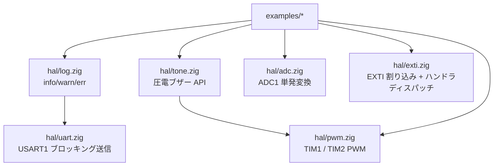
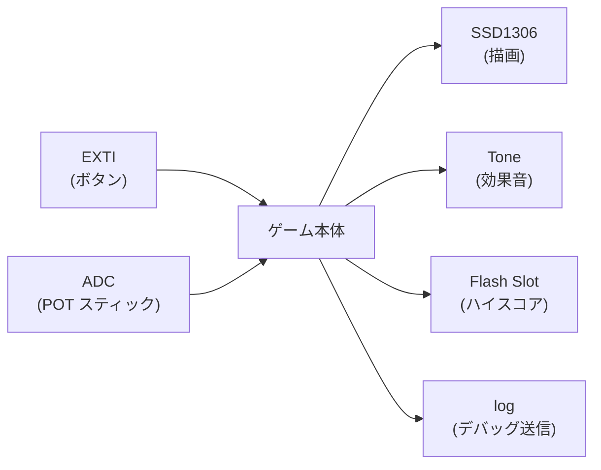

# Chapter 15: 周辺機能の HAL — UART / log / PWM / Tone / ADC / EXTI

## 学習目標

- 「ファームウェアでよくある 5 機能」を本プロジェクトのスタイルで使えるようになる
  - **UART で printf 風ログ** を出す
  - **PWM で LED を呼吸させる**
  - **PWM の上にトーン API** を被せて圧電ブザーで音を出す
  - **ADC** でアナログ電圧を読む
  - **EXTI** でボタン押下を割り込み駆動にする
- これらの HAL がどう「薄く」設計されているかを掴む
- 各 example の動作と必要な配線を把握する

---

## 全体マップ

これまでの章で扱った GPIO / SysTick / I2C / SSD1306 / FLASH に加え、 第V部の HAL ファミリーには次の 6 モジュールが新たに加わった:



設計方針はこれまでと同じ — **MCU の語彙にできるだけ薄く、 アプリ側ですぐ使える形だけ整える**。

---

## UART (`fun.uart`)

### 仕様

- ペリフェラル: **USART1**
- TX: **PD5** (リマップ無し)
- 受信: 未サポート (CTLR1.RE は立てない)
- ボーレート: コア (HCLK) を整数分周。 48MHz / `BRR`
- フォーマット: 8N1 固定

### API

```zig
pub fn init(baud: u32) void;
pub fn writeByte(b: u8) void;
pub fn writeAll(bytes: []const u8) void;
pub fn flush() void;
```

### 配線

```
PC USB-Serial:  RXD <----- PD5 (CH32V003 TX)
                GND <----- GND
```

USB-Serial 変換 (CP2102 等) の RXD を PD5 に、 GND を GND に。 端末を `115200bps 8N1` で開いて待ち受ける。

---

## log (`fun.log`)

### 仕様

UART の上に薄く被せた **printf 風ラッパ**。 内部に `[96]u8` の静的バッファを 1 本持ち、 `std.fmt.bufPrint` で整形して UART に流す。

### API

```zig
pub fn init(baud: u32) void;          // 内部で uart.init(baud) を呼ぶ
pub fn info(comptime fmt: []const u8, args: anytype) void;
pub fn warn(comptime fmt: []const u8, args: anytype) void;
pub fn err(comptime fmt: []const u8, args: anytype) void;
pub fn raw(bytes: []const u8) void;
```

### 注意点

- **割り込みコンテキストから呼ぶのは非推奨**。 UART がブロックしている間、 割り込みハンドラが寝てしまう
- バッファあふれは無視 (96B でフォーマット結果が打ち切られる)。 長文を吐きたければ複数回に分ける
- `\r\n` は自動付与

### 第13章で「使えない」と言ったログ系との関係

第13章で `std.debug.print` は freestanding でコンパイル不可だと書いた。 本モジュールはまさに **「OS が無くてもログを取りたい」 を埋める層**。 中身は `std.fmt.bufPrint` (これは freestanding でも使える) + 自前 UART 送信。

### サンプル: `examples/uart_hello`

```zig
const fun = @import("ch32fun");

pub fn main() noreturn {
    fun.system.init(.{});
    fun.log.init(115200);

    var n: u32 = 0;
    while (true) : (n +%= 1) {
        fun.log.info("hello from CH32V003! tick={d}", .{n});
        fun.time.delayMs(1000);
    }
}
```

書き込み:

```sh
zig build -Dexample=uart_hello flash
```

端末側で 1 秒おきに `[I] hello from CH32V003! tick=N` が増えていく。

---

## PWM (`fun.pwm`)

### 仕様

CH32V003 の 2 つの汎用タイマを PWM 出力に使えるよう包んだ。

| ペリフェラル | クラス | デフォルトチャネルピン |
|---|---|---|
| TIM1 | Advanced (MOE 必要) | CH1=PD2, CH2=PA1, CH3=PC3, CH4=PC4 |
| TIM2 | General | CH1=PD4, CH2=PD3, CH3=PC0, CH4=PD7 |

両方とも **PWM mode 1 (アクティブ Hi)** で固定。 デューティ比は `0 .. period` の整数。

### API

```zig
pub const Channel = enum(u2) { ch1, ch2, ch3, ch4 };
pub const Config = struct {
    period: u16 = 1000,
    prescaler: u16 = 0,
};

pub const tim1 = struct {
    pub fn init(cfg: Config) void;
    pub fn enableChannel(ch: Channel) void;
    pub fn setDuty(ch: Channel, value: u16) void;
    pub fn setPeriod(period: u16) void;
    pub fn stop() void;
};
pub const tim2 = struct { /* 同じ shape */ };
```

実効カウントクロック = `HCLK / (prescaler + 1)`、 PWM 周波数 = カウントクロック / `period`。

### サンプル: `examples/led_fade`

```zig
fun.gpio.pin(.D, 2).configure(.output_af_pp_10mhz);
fun.pwm.tim1.init(.{ .prescaler = 47, .period = 1000 }); // 48MHz/48/1000 = 1kHz
fun.pwm.tim1.enableChannel(.ch1);
// duty を 0 → 1000 → 0 と往復させて呼吸を作る
```

LED アノードを PD2、 カソードを GND (抵抗経由) で繋ぐと、 LED が明るくなったり暗くなったりする。

---

## Tone (`fun.tone`)

### 仕様

`pwm.tim2` の上に、 「周波数 (Hz) と長さ (ms) で 1 音鳴らす」 API を被せたもの。 デューティは 50% 固定。 内部プリスケーラは 256 分周で、 おおよそ 30Hz〜数 kHz の範囲をカバーする。

### API

```zig
pub fn init(channel: pwm.Channel) void;
pub fn play(freq_hz: u32, duration_ms: u32) void; // ブロッキング
pub fn stop() void;
```

### 配線

```
ブザー (+) ────── PD4 (TIM2_CH1)
ブザー (−) ────── GND
```

圧電ブザー (パッシブタイプ) 推奨。 アクティブブザーは内部発振器を持つので周波数制御が効かない。

### サンプル: `examples/tone_song`

ドレミファソラシド (C4 → C5) を 200ms ずつ鳴らしてループ。 `Note = struct { freq, ms }` のテーブル駆動でアプリ側を簡潔に保てる。

---

## ADC (`fun.adc`)

### 仕様

- ADC1、 10-bit、 単一チャネル変換、 ソフトウェアトリガ
- チャネルマップ (CH32V003):
  - ch0=PA2, ch1=PA1, ch2=PC4, ch3=PD2,
  - ch4=PD3, ch5=PD5, ch6=PD6, ch7=PD4
- サンプル時間は最大 (約 241 cycles) に統一

### API

```zig
pub const max_value: u16 = 1023;
pub fn init() void;
pub fn readSingle(channel: u8) u16;            // 0..1023
pub fn readAveraged(channel: u8, samples: u8) u16;
```

### 注意点

- 使う前に **対応 GPIO ピンを `.input_analog` に設定** すること
- Vref は `Vdd` (3.3V) なので、 mV 換算は `raw * 3300 / 1023`
- ノイズが気になるなら `readAveraged` で 4〜16 回平均を取るのが現実解

### サンプル: `examples/adc_meter`

```zig
fun.gpio.pin(.D, 2).configure(.input_analog); // ch3
fun.adc.init();
while (true) {
    const raw = fun.adc.readAveraged(3, 8);
    const mv: u32 = (@as(u32, raw) * 3300) / 1023;
    fun.log.info("ADC ch3 raw={d} ~{d}mV", .{ raw, mv });
    fun.time.delayMs(200);
}
```

可変抵抗を `3.3V — POT — GND` で繋ぎ、 中点を PD2 に。 つまみを回すと UART に 0〜3300 mV が流れる。

---

## EXTI (`fun.exti`)

### 仕様

GPIO ピンのエッジ検出で割り込みを発生させる。

- ライン番号 = ピン番号 (0..7)。 ライン 8..15 は別 IRQ なので今回は未対応
- AFIO.EXTICR でポート (A/C/D) を選ぶ
- トリガ: `rising` / `falling` / `both`
- ハンドラはライン別に登録 (内部に `[8]?Handler`)
- CH32V003 では ライン 0..7 は全部 **EXTI7_0_IRQn = 20** に集約されてくるので、 1 つのエントリで分配

### API

```zig
pub const Trigger = enum { rising, falling, both };
pub const Handler = *const fn (line: u8) callconv(.c) void;
pub const Config = struct {
    port: gpio.Port,
    line: u4,
    trigger: Trigger,
    handler: Handler,
};

pub fn config(cfg: Config) void;
pub fn enable(line: u4) void;   // INTENR + PFIC のラインを立てる
pub fn disable(line: u4) void;
```

### 起動側との結合

`src/runtime/startup.zig` の vector_table[16 + 20] が `_exti7_0_irq_entry` を指す。 その先で `exti.handleInterrupt()` が呼ばれ、 立っているラインだけハンドラを叩く。 第 6 章の SysTick ハンドラと同じ「全レジスタ退避 + mret」 パターン。

### サンプル: `examples/exti_button`

```zig
fn onButtonPress(line: u8) callconv(.c) void {
    _ = line;
    fun.gpio.pin(.D, 0).toggle();
}

pub fn main() noreturn {
    fun.system.init(.{});
    fun.gpio.enableAllClocks();
    fun.gpio.pin(.D, 0).configure(.output_pp_10mhz);
    fun.input.initButtonPd1Pullup();

    fun.exti.config(.{
        .port = .D, .line = 1, .trigger = .falling, .handler = onButtonPress,
    });
    fun.exti.enable(1);
    fun.system.enableInterrupts();

    while (true) fun.system.wfi();
}
```

メインループは `wfi` で寝るだけ。 ボタン押下 (= PD1 立ち下がり) があるたびに割り込みで起きて LED がトグルする。 ポーリング版 (`examples/gpio_input`) と動作は同じだが、 **CPU の稼働時間がほぼゼロ** になるので電池駆動に向く。

---

## モジュール間の組み合わせ

これらは単独で使えるが、 組み合わせると `examples/` 1 つでミニゲーム規模のことが作れる:



`examples/oled` + `examples/persistent_counter` + 本章の HAL を組み合わせれば、 「POT で照準を動かして、 ボタンで撃って、 当たったらブザーが鳴り、 ハイスコアが FLASH に残り、 UART でデバッグ情報が見える」 という構成がそのまま書ける。

---

## 制約と注意点 まとめ

| モジュール | 主な制約 |
|---|---|
| UART | TX のみ、 PD5 固定、 ブロッキング (busy wait) |
| log | バッファ 96B 切り詰め、 割り込みからは呼ばない |
| PWM | mode は PWM1 (アクティブ Hi) 固定、 4 ch のみ、 出力反転は未対応 |
| Tone | 50% デューティ固定、 1 音ずつブロッキング |
| ADC | サンプル時間最大 241cyc 固定、 連続変換/シーケンス変換は未対応 |
| EXTI | ライン 0..7 のみ、 1 ライン 1 ハンドラ、 デバウンスは無し |

それぞれ「**もう一段豪華に**」 したい場合の拡張ポイントは明確。 必要が出たタイミングで HAL を継ぎ足していけば良い。

---

## まとめ

- 第V部までで「Zig で安全に書ける範囲」を整理したが、 本章では実機の「便利な周辺」 を HAL に落とし込み、 アプリから 1〜数行で使えるようにした
- UART + log があると、 デバッグの一手目が **「LED 点滅」 から 「`log.info` で文字列を吐く」** に進化する
- PWM + Tone + ADC + EXTI が揃うと、 ミニゲームのインタラクション一式が CH32V003 上で完結する
- いずれも実装は 50〜120 行程度の薄い HAL。 不足分は同じスタイルで継ぎ足せる
